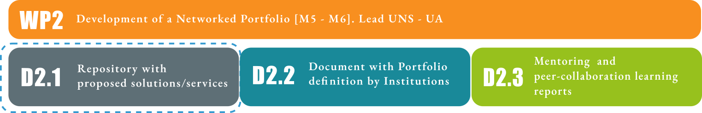
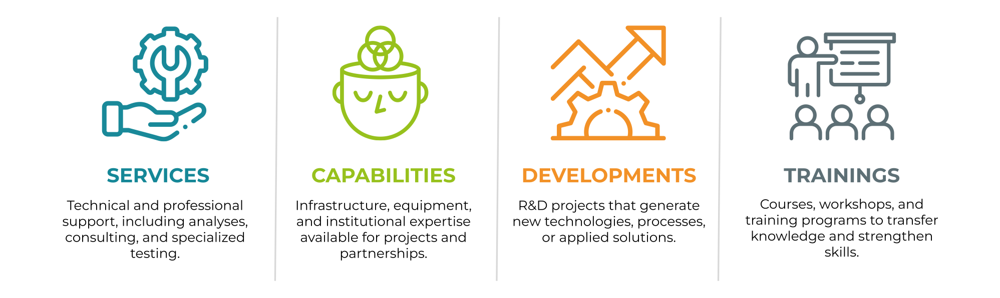
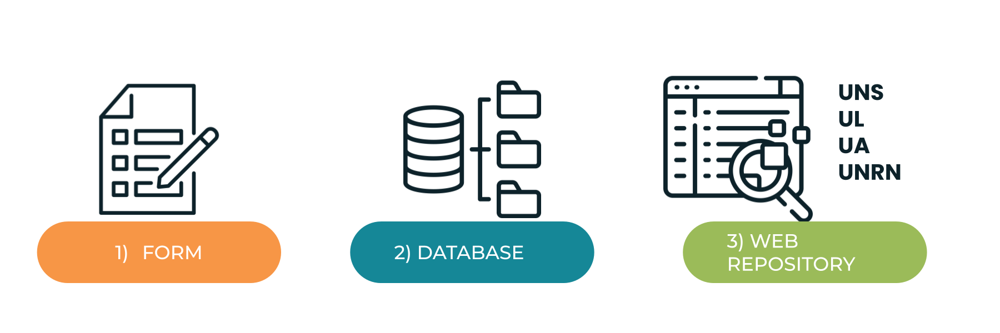
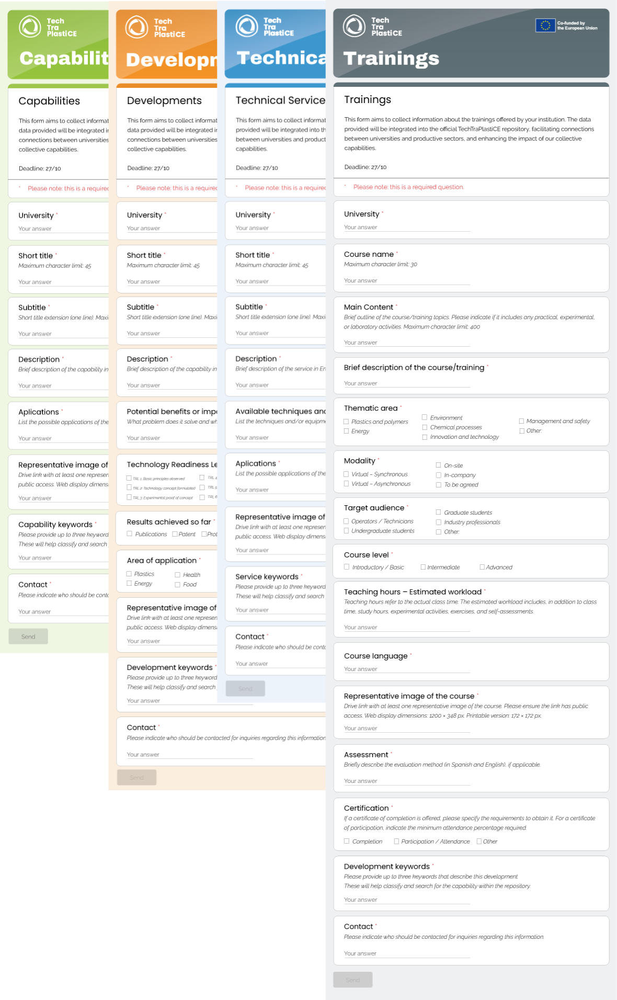
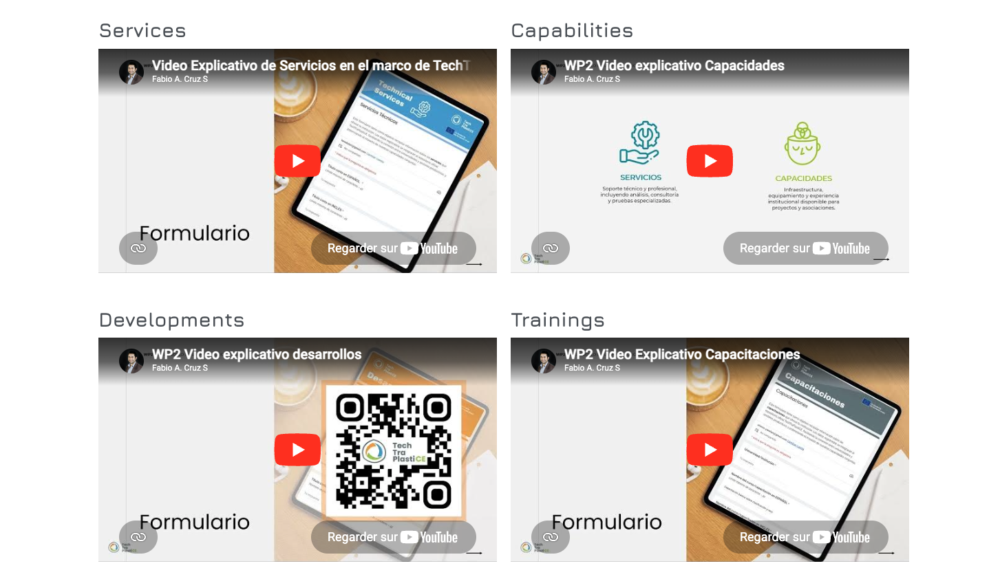
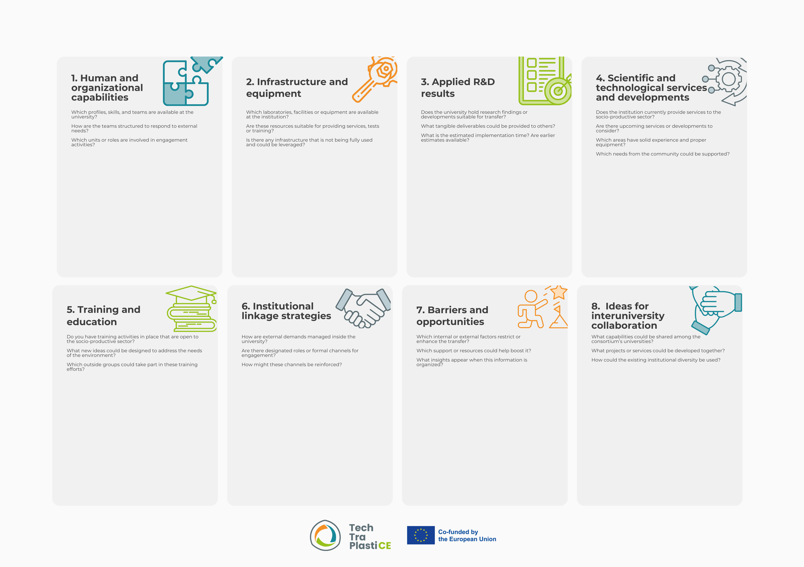
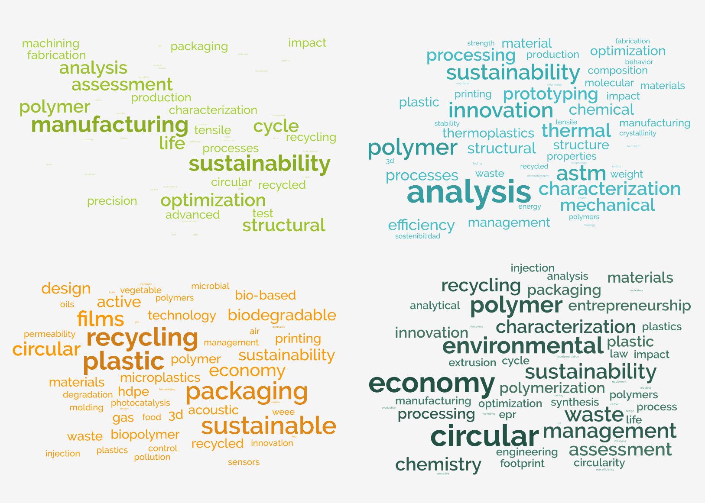
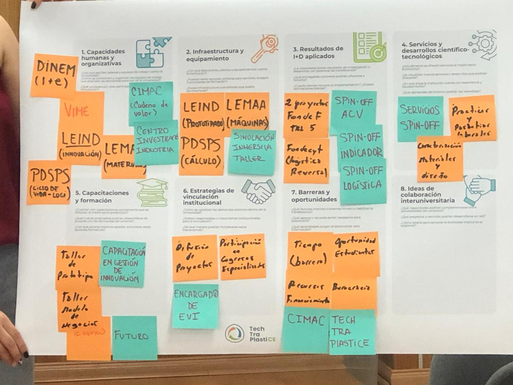
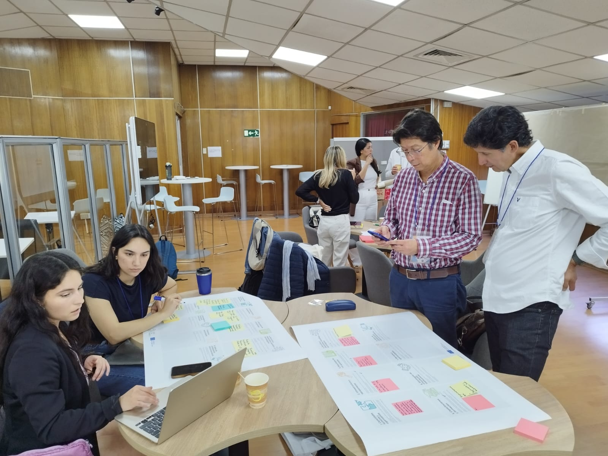
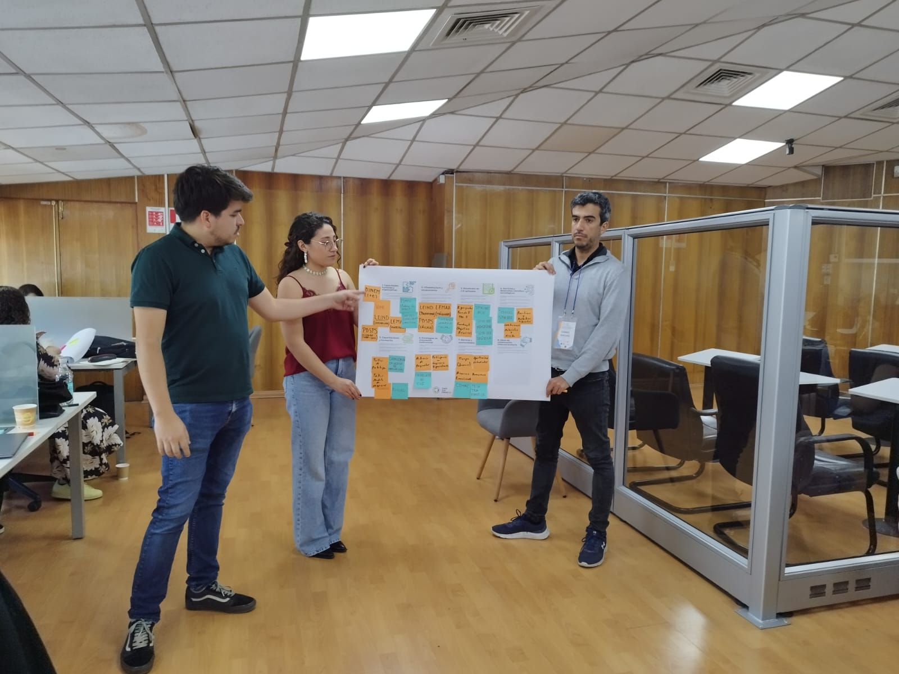

```{r setup, include=FALSE, echo=FALSE}
knitr::opts_chunk$set(echo = FALSE, fig.retina = 3, message = FALSE, warning = FALSE)
options(knitr.kable.NA = '')

library(tidyverse)
library(kableExtra)
library(readxl)
library(here)

```


# Introduction

The Work Package 2 (WP2) of the TechTraPlastiCE project focuses on the development of a networked portfolio of institutional *services, capacities, developments, and training* activities related to the circular economy of plastics. 
This work package is conceived as a foundational component within the overall project structure, aiming to systematically capture and organize the existing competencies of partner institutions as a basis for subsequent stages of analysis, co-creation, and implementation. 
In this sense, the aim of WP2 is to identify, structure, and systematize the existing competencies of partner institutions in order to: (i) support university–industry collaboration, (ii) strengthen technology transfer mechanisms, and (iii) contribute to the development and consolidation of circular economy value chains in Latin America and Europe. 

By addressing these dimensions, WP2 directly contributes to enhancing the role of Higher Education Institutions (HEIs) as active agents in innovation ecosystems, particularly in relation to sustainability challenges associated with plastics. 
This objective is fully aligned with the broader ambition of the TechTraPlastiCE project, which seeks to reinforce applied research and technology transfer capacities within HEIs. 
In this context, the project promotes a progressive and systemic approach to technology transfer, encouraging universities to move beyond traditional academic roles and engage more actively with socio-economic stakeholders through services, training, and applied research activities.

Within the framework of the project, WP2 represents a key structuring phase. It provides the baseline mapping necessary to support the co-creation of institutional service portfolios, while also enabling a deeper understanding of the diversity, scope, and maturity of technology transfer activities across the consortium. This mapping is particularly relevant in a multi-institutional and transnational context, where differences in capacities, priorities, and operating environments must be acknowledged and strategically articulated. 

In this context, the present deliverable (D2.1) constitutes a first critical step in the WP2 process. Its primary objective is ***to identify, collect, and systematize a wide range of existing and potential solutions, services, and approaches that can support the transition of the plastic value chain towards more circular and sustainable models***. 
This repository provides a comprehensive and structured overview of the capabilities available within the consortium, capturing contributions across multiple dimensions, including services, technological developments, training activities, and institutional capacities. 
In particular, the repository seeks to highlight the spectrum of possible interventions, ranging from recycling technologies and material valorization strategies to training programs, consultancy services, awareness-raising initiatives, and collaborative innovation processes. 

In summary, the D2.1 enables the survey of both individual institutional strengths and potential complementarities across partners by organizing this information into a coherent and accessible format. 
Moreover, this deliverable acts as the organizer of the database necessary for the subsequent analysis included in D2.2, by providing the raw material required to develop institution-specific portfolios and to advance towards more operational and demand-driven technology transfer strategies. 
Consequently, D2.1 not only contributes to documenting existing capacities but also supports a strategic shift from isolated and fragmented initiatives towards a more integrated, visible, and collaborative network of services within the consortium. 

{#fig-baseline fig-alt="alt"}


# Connection with WP1 Innovation Opportunities for Circular Economy

Work Package 2 (WP2) builds directly on the analytical and empirical results generated in Work Package 1 (WP1), included in deliverables D1.1, D1.2, and D1.3. 
These deliverables provided a comprehensive and multidimensional diagnosis of the regulatory frameworks, industrial structures, and innovation capabilities that shape the circular economy of plastics in Argentina, Chile, and Colombia. 
WP1 establishes a systemic understanding of the context in each region, identifying key barriers, stakeholders, and structural dynamics. 
On the other hand, WP2 seeks to identify, through a structured and operational mapping of the institutional capacities of each consortium member, the knowledge that can help key stakeholders overcome these barriers. 
In this sense, WP2 represents a crucial transition from diagnosis to action, enabling the operationalization of university-industry collaboration through concrete, structured, and deployable results. 
Rather than remaining at the level of analysis, WP2 helps bridge the gap between knowledge generation and implementation by organizing institutional competencies into practical categories that can directly address the challenges identified in WP1.

## From Regulatory and Institutional Diagnosis (D1.1)

WP1 identified that Chile, Colombia and Argentina have developed regulatory frameworks addressing plastic waste management and circular economy principles. However, these frameworks differ significantly in terms of implementation capacity, institutional coordination, and enforcement mechanisms.

Chile stands out for its relatively consolidated legal framework, supported by measurable targets and structured implementation mechanisms. 
Colombia demonstrates rapid progress in policy integration, particularly in relation to the inclusion of recycling actors and the development of extended producer responsibility schemes. 
Argentina, on the other hand, shows strong industrial and productive capabilities, but faces challenges related to fragmented governance structures and limited policy articulation across jurisdictions.

Across these three contexts, a set of common systemic barriers was identified, including:

* Weak enforcement mechanisms that limit the effectiveness of existing regulations;
* Limited economic incentives to promote circular practices;
* Lack of traceability systems to monitor material flows;
* Insufficient coordination between public institutions, private actors, and civil society.

These constraints define the operational environment in which WP2 is implemented. In response, WP2 focuses on identifying and structuring university-based services and capacities that can actively contribute to overcoming these barriers. In particular, WP2 seeks to support the implementation of regulatory frameworks through technical advisory and scientific services; strengthen coordination mechanisms by mapping and activating institutional engagement structures; and provide technical, analytical, and organizational support to stakeholders involved in the plastics value chain.

Through this approach, WP2 positions universities as key intermediaries capable of supporting policy implementation and fostering more coherent and effective governance systems.

### From value chain and systemic innovation analysis (D1.2)

WP1 highlighted key structural characteristics of the plastics value chain such as a strong dependence on a limited set of polymers (polyethylene, polypropylene, polyvinyl chloride and polystyrene), a concentration of industrial activities in specific sectors, and the central role of packaging, construction, and agriculture as primary areas of application.

The transition towards a circular economy in this context requires more than isolated technological solutions. It demands systemic innovation processes that involve the reconfiguration of interactions between actors, as well as the integration of technological, social, and institutional dimensions.

A particularly relevant finding concerns the role of recyclers, especially informal actors, who play a critical role in material recovery but remain insufficiently integrated into formal value chains. This highlights the need for inclusive and systemic approaches that recognize and strengthen these actors within the circular economy ecosystem.

In this context, WP2 addresses these challenges by mapping institutional capacities that are relevant for supporting circular economy implementation across the value chain; identifying and structuring training activities targeted at diverse stakeholders, including SMEs, public institutions, and recycling actors; as well as organizing applied research outputs that can contribute to both technological innovation (e.g., materials, processes) and organizational innovation (e.g., business models, coordination mechanisms).

Through this approach, WP2 contributes to enabling systemic innovation by linking knowledge production with practical applications and stakeholder needs.

### From Innovation Capacity Assessment (D1.3)

The assessment conducted in WP1 regarding innovation capacities within companies revealed significant asymmetries across the industrial landscape. 
Large companies tend to demonstrate stronger innovation performance, supported by greater access to resources, infrastructure, and strategic capabilities. 
In contrast, SMEs and micro-enterprises show considerable weaknesses, including limited access to technology, reduced capacity for R&D, and lower levels of integration into innovation ecosystems.
These findings underscore the need for targeted support mechanisms that can enhance the innovation capacity of smaller actors, which are nonetheless essential components of the plastics value chain.

In addition, WP1 facilitated the creation of a direct interface between academia and industry, identifying concrete opportunities for collaboration and applied research.
WP2 builds on these results by:

* Aligning institutional service offerings and training programs with the specific needs of SMEs;
* Structuring accessible technological services that lower barriers to innovation adoption;
* Supporting the development of long-term university–industry partnerships, based on trust, complementarities, and shared objectives.

In this sense, WP2 contributes to democratizing access to knowledge and technology, reinforcing the role of universities as enablers of inclusive innovation.

## Operational mapping: from WP1 barriers to WP2 components

To ensure a coherent and traceable transition from diagnosis to action, WP2 translates the findings of WP1 into four operational categories: services, capacities, developments, and training. 
This categorization allows us for a systematic organization of institutional contributions and facilitates their alignment with identified needs and gaps.

@tbl-link illustrates this operational strategy, establishing a direct link between the barriers identified in WP1 and the corresponding WP2 components designed to address them. This mapping ensures that the activities developed within WP2 are not only theoretically grounded but also strategically oriented towards solving concrete challenges within the plastics circular economy.


```{r}
#| label: tbl-link
#| tbl-cap: "Operational link between WP1 findings and WP2 components."
#| tbl-pos: H


table <- 
tribble(
~"WP1 Identified Barrier / Gap",
~"Source",
~"WP2 Category",
~"Operationalization",
"Weak policy implementation",
"D1.1",
"Services / Capacities",
"Technical advisory and support services",
"Lack of traceability",
"D1.1",
"Developments / Services",
"Analytical tools and characterization services",
"Limited coordination",
"D1.1",
"Capacities",
"Mapping of institutional engagement structures",
"Regulatory fragmentation",
"D1.1",
"Training / Services",
"Training and advisory support",
"Low adoption of circular practices",
"D1.1 / D1.2",
"Services / Training",
"Industry-oriented services and training",
"Limited innovation in materials",
"D1.2",
"Developments",
"Identification of applied R\\&D outputs",
"Weak recycler integration",
"D1.2",
"Training / Services",
"Inclusive training approaches",
"SME innovation gaps",
"D1.3",
"Training / Services",
"Capacity-building and technical support",
"Limited access to technology",
"D1.3",
"Services / Capacities",
"Access to infrastructure and expertise",
)

table %>%
  mutate_all(linebreak) %>%
  kbl("latex", booktabs = T, escape = F, 
      longtable = T, 
      linesep = "\\midrule\\addlinespace") %>%
   kable_styling(full_width = F, 
                latex_options = c("repeat_header"),                
                font_size = 11) %>% 
   row_spec(0, color = "white", background = "Naranja", bold = T, font_size = 12) %>%
   column_spec(1, width = c("5cm"))  %>%
   column_spec(2, width = c("2cm"))  %>%
   column_spec(3, width = c("4.5cm"))  %>%
   column_spec(4, width = c("4cm"))  

```


## Functional translation into WP2 categories

Within WP2, institutional contributions are organized into four complementary axes:

{width="85%" fig-align="center"}

* **Services**: referring to technical and scientific services that address the immediate and practical needs of socio-economic actors;
* **Capabilities:** encompassing institutional competencies, expertise, and available infrastructure;
* **Developments**: including applied research outputs and technological solutions with transfer potential at different levels of maturity;
* **Training**: covering educational and capacity-building activities targeting a wide range of stakeholders.

This structured approach enables a comprehensive representation of the role of universities, capturing both their existing capabilities and their potential contributions to the circular economy.

## Integration through the Canvas Methodology

The canvas-based workshop complements this mapping by providing a **co-creation mechanism** that:

* Captures institution-specific insights;
* Identifies current and future capacities;
* Supports the identification of collaboration opportunities.

Each canvas dimension reflects WP1 findings, including:

1. Institutional coordination challenges (institutional engagement strategies);
2. Innovation gaps (capabilities and applied R&D results);
3. Inclusion challenges (training and barriers and opportunities).

## From diagnosis to operationalization

WP1 provides the diagnostic framework, while WP2 transforms this diagnosis into structured institutional responses.
This transition enables:

* The development of institutional portfolios;
* The implementation of progressive technology transfer mechanisms;
* The preparation of collaborative actions in subsequent work packages.


## Connection with future Work Packages 3 and 4

The outputs generated within WP2 serve as a critical baseline for the development of subsequent work packages. In particular, they provide the necessary inputs for the design and refinement of institutional portfolios; the development of targeted training programs; and the implementation of pilot collaboration initiatives between universities and external stakeholders.

By structuring and systematizing institutional capacities, WP2 establishes the empirical and operational foundation upon which WP3 and WP4 can build. It ensures that subsequent activities are grounded in a clear understanding of available resources, competencies, and opportunities for collaboration.

Ultimately, WP2 contributes to strengthening the coherence and effectiveness of the project as a whole, enabling a coordinated and strategic progression from mapping and analysis to implementation and impact.


# Global methodology

The methodological approach adopted in WP2 is based on a comprehensive mixed-method design that integrates structured quantitative-oriented data collection with qualitative, participatory, and iterative processes. 
This approach has been specifically conceived to respond to the complexity of mapping technology transfer capacities across a heterogeneous, multi-institutional, and transnational consortium.

{#fig-method01  width="80%" fig-align="center"}

Given the diversity of institutional profiles, levels of maturity in technology transfer, and socio-economic contexts represented within the project, a purely standardized or purely qualitative methodology would have been insufficient. 
Therefore, WP2 adopts a hybrid methodological framework that ensures both analytical rigor and contextual sensitivity, enabling the generation of robust, comparable, and actionable results.


The methodology combines three main components as illustrated in @fig-method01:

1. Structured questionnaires for systematic data collection;
2. An iterative data collection and validation process;
3. A participatory canvas-based workshop for co-creation and qualitative enrichment.

These components are not independent but function as interconnected stages within a progressive methodological sequence, in which data is continuously refined, validated, and contextualized.
This integrated approach enables the construction of a standardized and comparable dataset across institutions and countries; the incorporation of context-specific qualitative insights, capturing institutional diversity; the progressive refinement and validation of information, ensuring data quality and reliability; the active engagement of partner institutions in the co-creation of knowledge; and the transformation of dispersed institutional information into structured and operational outputs.

Furthermore, this methodological design ensures a clear alignment with the objectives of WP2, particularly in terms of supporting the development of institutional portfolios and facilitating the transition from diagnostic analysis (WP1) to operational implementation (WP3 and WP4).

## Structured questionnaires

Structured questionnaires were developed as the primary instrument for data collection to systematically capture detailed and comparable information on the technology transfer capacities of partner institutions. 
They were designed to collect data across four core dimensions that reflect the operational categories of WP2:

- **Capabilities**: Research and innovation activities, including applied research and technological development;
- **Services**: Technology transfer mechanisms and services offered to external stakeholders;
- **Trainings**: Capacity-building activities targeting different audiences;
- **Developments**: Applied research activities and collaboration practices with socio-economic actors, including industry, public institutions, and civil society organizations.

The design of the questionnaires was established taking into account the analytical framework assessed in WP1, ensuring coherence between the diagnostic phase and the mapping of institutional capacities. 
In addition, specific attention was given to aligning the structure of the questionnaires with the final outputs expected in WP2, particularly the construction of technology cards and institutional portfolios. 

In this sense, @fig-questionnaires includes the Google questionnaires for each axis .


{#fig-questionnaires width="75%" fig-align="center"}


To support a consistent interpretation of the categories and ensure methodological alignment across partners, the questionnaires were complemented by a set of guidance materials. 
These included detailed written instructions as well as explanatory videos specifically developed for each category (services, capacities, developments, and training). 
Although the slides in the videos are presented in English, the audio is in Spanish, as it is the common working language among consortium members. 
@fig-videos present the videos that can be accessed through the following link: [https://wp6.techtraplastice.eu/wp2-portfolio.html](https://wp6.techtraplastice.eu/wp2-portfolio.html)


{#fig-videos width="80%" fig-align="center"}

The incorporation of video-based guidance represents a key methodological innovation within WP2. 
These videos provided clear definitions and conceptual boundaries for each category; practical examples illustrating how to complete the forms; clarifications on common sources of confusion or overlap between categories; and step-by-step instructions for completing the questionnaires. 
This multimodal guidance approach proved to be particularly valuable in a context characterized by linguistic diversity (Spanish, Portuguese and English), different institutional cultures, and dispair levels of familiarity with technology transfer processes. 
It contributed significantly to reducing interpretation biases and improving the overall consistency of the data collected.

The structured nature of the questionnaires ensured a high degree of comparability across institutions, enabling cross-case analysis; a comprehensive coverage of key thematic areas relevant to the circular economy of plastics; and a consistent format that facilitates subsequent coding, categorization, and analysis.
Through these questionnaires, institutions were able to provide detailed descriptions of their activities; highlight specific features or innovations; and reflect on the potential applications and beneficiaries of their activities.
The timeline for respond the questionnaires was between **September 2025 - November 2025**.

## Iterative data collection process

The data collection process in WP2 was conceived as an iterative and guided process, structured in four main stages. 
This iterative logic was fundamental to ensuring not only the completeness of the dataset but also its quality, coherence, and alignment with the methodological framework.

### Step 1 – Guidance and Orientation

The process began with a comprehensive guidance phase, where partner institutions were provided with all necessary materials to complete the questionnaires. This included written instructions, methodological guidelines, and explanatory videos tailored to each category. This initial stage was critical to establishing a shared understanding of the objectives, categories, and expected outputs. It also helped to align partners with the conceptual framework of WP2 and to ensure consistency from the outset of the data collection process.


### Step 2 – Sequential Data Entry

Partners were instructed to complete the questionnaires following a predefined sequence:

1. Services (Mid Sept 2025 )
2. Capacities (Oct 205)
3. Developments (Mid Oct 2025)
4. Training (November 2025)

This sequence was strategically defined to guide institutions through a structured reflection process. 
Starting with services, typically more visible and externally oriented, allowed institutions to identify their immediate offerings. 
This was followed by capacities, which represent the underlying resources and competencies that enable these services. Subsequently, the focus shifted to developments, capturing applied research outputs and technological innovations. 
Finally, training activities were addressed, highlighting the role of institutions in knowledge dissemination and capacity building. This approach not only facilitated the data entry process but also encouraged institutions to reflect on the internal coherence of their activities and the relationships between different types of capacities.
At the general monthly meetings of the TechTraPlastiCE consortiums, there was the oppportunity to answer quaestions and clarify the scope of the questionnaires.

### Step 3 – Submission, Review, and Feedback

Forms were submitted in both Spanish and English.
The use of bilingual submissions ensured inclusivity while also requiring additional attention to consistency and comparability. Following submission, a systematic internal review process was carried out. This process included:


* Verification of data completeness;
* Assessment of internal consistency across entries;
* Review of the categorization assigned to each case;
* Identification of potential overlaps or misclassifications;
* Evaluation of clarity and quality of descriptions.

Where inconsistencies or ambiguities were identified, feedback was provided to the corresponding institutions, initiating a revision process. This feedback loop constitutes a key element of the iterative methodology, allowing for continuous improvement of the dataset. This stage ensured that the information used for subsequent analysis was not only complete but also coherent and aligned with the project’s methodological criteria. Conclusions of this step are included in the D2.2.


### Step 4 – Timeline and Process Coordination

The data collection process was conducted between October and early December 2025. This period was carefully planned to allow sufficient time for data entry, review, feedback, and revision, while maintaining alignment with the overall project timeline. Throughout this phase, continuous communication was maintained with partner institutions, providing support, resolving doubts, and ensuring adherence to deadlines. This active coordination contributed to a high level of participation and data completeness across the consortium.


## Workshop and canvas-based methodology

A consortium workshop held in Chile implemented a canvas-based co-creation exercise (@fig-canva), designed to capture additional qualitative insights, identify existing gaps and future opportunities, and support the co-design of institutional portfolios. 

{#fig-canva width="100%" fig-align="center"}

The canvas was organized into eight dimensions: i) human and organizational capabilities; ii) infrastructure and equipment; iii) applied R&D results; iv) scientific and technological services and developments; v) training and education; vi) institutional engagement strategies; vii) barriers and opportunities; and viii) ideas for inter-university collaboration. 
Each dimension was explored through guiding questions and collective discussion. 
The outputs generated through this exercise were documented and integrated as complementary qualitative data, enriching the structured dataset built through the questionnaires as illustrated in @fig-chile. 
Obtained results from this activity complemented the analysis carried out in the following deliverables (D2.2 and D2.3).

{#fig-chile width="60%" fig-align="center"}


<!-- ## External advisory board contribution

External experts were progressively involved in WP2 activities to:

* Provide feedback on data collection processes
* Prepare for the evaluation of institutional portfolios
* Contribute to the interpretation of results in relation to: i) the circular economy of plastics; and ii) Regional and European contexts. -->


## Methodological Contribution to WP2 Objectives

Beyond its role in data collection, the methodological approach adopted in WP2 contributes directly to the broader objectives of the work package. By combining structured data with participatory processes, it enables the transformation of fragmented information into structured knowledge; the identification of institutional strengths and complementarities; the development of comparable and operational institutional portfolios; and the preparation of the consortium for subsequent collaborative and implementation phases. In this sense, the methodology is not only a technical tool but also a strategic instrument that supports the transition from analysis to action within the project.


# Data collected

The data collected within WP2 comprises both structured and qualitative inputs, reflecting the mixed-method approach adopted throughout the work package. 
@fig-worldcloud illustrates the major keywords of the dataset.
On the one hand, raw data was systematically gathered through the structured questionnaires completed by all member universities. 
These responses constitute the primary dataset, capturing detailed information across the four core dimensions defined in WP2 (services, capacities, developments, and training). 
As illustrated in @tbl-developments, @tbl-capabilities, @tbl-technical and @tbl-training,  the collected data is presented in tabular format to ensure clarity, comparability, and traceability across institutions. 
Full access to these tables was provided for the consortium repository. 
In the annexes @sec-A2, the complete raw data is plotted for the four questionnaires.


{#fig-worldcloud width="75%" fig-align="center"}


:::landscape

## Developments at each HEIs

```{r}
#| label: tbl-developments
#| tbl-cap: "Primary dataset of **Developments** at each HEI. Complete dataset is found in the Annex"

# Global data
# datos <- 
# read_excel(here("delivrables/annex/2.1/Developments - Responses.xlsx")) %>% 
#   select(1,3,5)  %>% 
#   set_names(c("HEI", "Title", "Description"))  %>% 
#    arrange(desc(HEI))
# write.csv(datos, file="delivrables/annex/2.1/Table1.csv")
# rm(datos)

datos <- read_csv(file = here("delivrables/annex/2.1/Table1.csv"))

 
datos %>%   
  mutate(Description = tolower(Description))  %>% 
  rowid_to_column("ID") %>% 
  select(HEI, ID, Title, Description) %>% 
  arrange(HEI) %>%
  mutate_all(linebreak) %>%
  kbl("latex", booktabs = T, escape = F, row.names = F,
      longtable = T, 
      #linesep = "\\midrule\\addlinespace"      
      ) %>%
   kable_styling(full_width = F, latex_options = c("repeat_header", "scale_down"), font_size = 7) %>% 
   row_spec(0, color = "white", background = "Naranja", bold = T, font_size = 7) %>%
   column_spec(1, width = c("3cm"))  %>%
   column_spec(2, width = c("0.6cm"))  %>%
   column_spec(3, width = c("5.5cm")) %>%
   column_spec(4, width = c("9.5cm")) %>%   
   collapse_rows(columns = 1:1, valign = "top")
   #pack_rows("Group 1", 3, 5, label_row_css = "background-color: #666; color: #fff;")
```


\newpage

## Capabilities at each HEIs

```{r}
#| label: tbl-capabilities
#| tbl-cap: "Primary dataset of **Capabilities** at each HEI. Complete dataset is found in the Annex"

# Global data

# datos <- 
#  read_excel(here("delivrables/annex/2.1/Capabilities - Responses.xlsx")) %>% 
#    select(1,3,5)  %>% 
#    set_names(c("HEI", "Title", "Description"))  %>% 
#     arrange(desc(HEI))
# write.csv(datos, file="delivrables/annex/2.1/Capabilities.csv")
# rm(datos)

datos <- read_csv(file= here("delivrables/annex/2.1/Capabilities.csv"))
datos$Title <- gsub("&", " and ", datos$Title)
datos$Description <- gsub("&", " and ", datos$Description)

#datos %>% str_detect("&")
#View(datos)

datos <- 
  datos %>% 
  rowid_to_column("ID") %>% 
  select(HEI, ID, Title, Description) %>% 
  mutate(Description = tolower(Description))  %>% 
  arrange(HEI) %>%
  #mutate_all(linebreak) %>%
  kbl("latex", booktabs = T, escape = F, row.names = F,
      longtable = T, 
      #linesep = "\\midrule\\addlinespace"      
      ) %>%
   kable_styling(full_width = F, latex_options = c("repeat_header", "scale_down"), font_size = 7) %>% 
   row_spec(0, color = "white", background = "Naranja", bold = T, font_size = 7) %>%
   column_spec(1, width = c("3cm"))  %>%
   column_spec(2, width = c("0.6cm"))  %>%
   column_spec(3, width = c("5.5cm")) %>%
   column_spec(4, width = c("9.5cm")) %>%   
   collapse_rows(columns = 1:1, valign = "top")
   #pack_rows("Group 1", 3, 5, label_row_css = "background-color: #666; color: #fff;")

datos   
```


\newpage

## Technical Services at each HEIs

```{r}
#| label: tbl-technical
#| tbl-cap: "Primary dataset of **Technical Services** at each HEI. Complete dataset is found in the Annex"

# Global data
# datos <- 
#  read_excel(here("delivrables/annex/2.1/Technical Services - Responses.xlsx")) %>% 
#    select(1,3,5,11)  %>% 
#    set_names(c("HEI", "Title", "Description", "Aplication"))  %>% 
#    arrange(desc(HEI))
# write.csv(datos, file="delivrables/annex/2.1/Technical.csv")
# rm(datos)

datos <- 
read_csv(file= here("delivrables/annex/2.1/Technical.csv"))  %>% 
arrange(desc(HEI))
#View(datos)


# Chnge the & character
#datos %>% str_detect("&")
datos$Title <- gsub("&", " and ", datos$Title)
datos$Description <- gsub("&", " and ", datos$Description)
datos$Aplication <- gsub("&", " and ", datos$Aplication)

#datos$Aplication %>% tolower()

datos <- 
  datos %>% 
  rowid_to_column("ID") %>% 
  select(HEI, ID, Title, Description) %>% 
  mutate(Description = tolower(Description))  %>% 
  arrange(HEI) %>%
  #mutate_all(linebreak) %>%
  kbl("latex", booktabs = T, escape = F, row.names = F,
      longtable = T, 
      #linesep = "\\midrule\\addlinespace"      
      ) %>%
   kable_styling(full_width = F, latex_options = c("repeat_header", "scale_down"), font_size = 7) %>% 
   row_spec(0, color = "white", background = "Naranja", bold = T, font_size = 7) %>%
   column_spec(1, width = c("2.5cm"))  %>%
   column_spec(2, width = c("0.6cm"))  %>%
   column_spec(3, width = c("5.5cm")) %>%
   column_spec(4, width = c("9.5cm")) %>%   
   collapse_rows(columns = 1:1, valign = "top")
   #pack_rows("Group 1", 3, 5, label_row_css = "background-color: #666; color: #fff;")

datos   
```


\newpage

## Training Programs at each HEIs


```{r}
#| label: tbl-training
#| tbl-cap: "Primary dataset of **Training** at each HEI. Complete dataset is found in the Annex"

# Global data


# Global data
# datos <- 
#  read_excel(here("delivrables/annex/2.1/Training - Responses.xlsx")) %>% 
#    select(1,3,5,11)  %>% 
#    set_names(c("HEI", "Title", "Description", "Level"))  %>% 
#    arrange(desc(HEI))
# write.csv(datos, file="delivrables/annex/2.1/Training.csv")
# rm(datos)


datos <- 
read_csv(file= here("delivrables/annex/2.1/Training.csv")) %>% 
arrange(desc(HEI))

datos$Level <- as.factor(datos$Level)
datos <-
  datos %>% 
  mutate(Level = recode(Level, Avanzado = "Advanced",
          Intermedio = "Medium",
          `Introductorio / básico` = "Introductory"
      ))

# Chnge the & character
#datos %>% str_detect("&")
datos$Title <- gsub("&", " and ", datos$Title)
datos$Description <- gsub("&", " and ", datos$Description)
#datos$Aplication <- gsub("&", " and ", datos$Aplication)

#datos$Aplication %>% tolower()

datos <- 
  datos %>% arrange(desc(HEI)) %>% 
  rowid_to_column("ID") %>% 
  select(HEI, ID, Title, Description) %>% 
  arrange(HEI) %>%
  #mutate_all(linebreak) %>%
  kbl("latex", booktabs = T, escape = F, row.names = F,
      longtable = T, 
      #linesep = "\\midrule\\addlinespace"      
      ) %>%
   kable_styling(full_width = F, latex_options = c("repeat_header", "scale_down"), font_size = 7) %>% 
   row_spec(0, color = "white", background = "Naranja", bold = T, font_size = 7) %>%
   column_spec(1, width = c("3.5cm"))  %>%
   column_spec(2, width = c("1cm"))  %>%
   column_spec(3, width = c("5cm")) %>%
   column_spec(4, width = c("9cm")) %>%   
   collapse_rows(columns = 1:1, valign = "top")
   #pack_rows("Group 1", 3, 5, label_row_css = "background-color: #666; color: #fff;")

datos   
```

:::


On the other hand, complementary qualitative data was obtained through the canvas-based workshop carried out during the consortium meeting in Chile as illustrated in the @fig-workshop. 
This includes visual records of the completed canvas (@fig-canva1) by each HEIs, which capture collective reflections (@fig-canva2 and @fig-canva3) on the institutional insights, and identified opportunities for collaboration. 
These materials provide additional context and depth to the structured dataset that are  included in the @sec-A2.


:::{#fig-workshop layout="[[100],[48,-3,48]]"}

{#fig-canva1 width="60%" fig-align="center"}

{#fig-canva2 width="60%" fig-align="center"}

{#fig-canva3 width="60%" fig-align="center"}

:::

Together, these sources constitute a comprehensive and multi-layered dataset that will be fully used during the WP2 development, enabling both systematic analysis and contextual interpretation of the technology transfer capacities within the consortium.

## Key performance indicators

@tbl-kpi presents the key performance indicators defined to assess the implementation and effectiveness of Task 2.1. 
These indicators provide a quantitative overview of the data collection process and the scope of the information gathered across partner institutions. 
Results demonstrate a high level of engagement and consistency among the participating universities. 
Responses of the four structured questionnaires reached 100% of the member universities, all of which completed the process. 
This full participation ensured a comprehensive dataset, enabling a robust characterization of technology transfer capacities within the consortium.

In terms of raw data content, the collection process resulted in the identification of 127 services, 83 capacities, 44 training offers, and 49 developments. 
These reflect the diversity and breadth of activities carried out by the partner institutions in the field of plastic circular economy. Moreover, it is important to note that each entry corresponds to an individual form submitted by the partners, without prior aggregation or normalization. 
This approach preserves the granularity of the information. More detailed and accurate analysis is presented in the following deliverables.


```{r}
#| label: tbl-kpi
#| tbl-cap: "Key performance indicators of Task 2.1."
#| tbl-pos: H


table <- 
tribble(
~"Description",
~"Value",
"Number of questionnaires developed",
"4",
"Number of partners provided with questionnaires",
  "100\\% of the member universities ",
"Completion rate of questionnaires",
"100\\%",
"Number of services identified*",
"127",
"Number of capacities mapped*",
"83",
"Number of training offers* ",
"44",
"Number of developments*",
"49",
"*Each entry corresponds to one individual form submitted by partners, without prior aggregation or normalization.", 
" " ,
)


table %>%
  mutate_all(linebreak) %>%
  kbl("latex", booktabs = T, escape = F,
      linesep = "\\midrule\\addlinespace") %>%
   kable_styling(full_width = F,                 
                font_size = 11) %>% 
   row_spec(0, color = "white", background = "Naranja", bold = T, font_size = 12) %>%
   column_spec(1, width = c("8cm"))  %>%
   column_spec(2, width = c("3cm"))  %>% 
   row_spec(8, font_size = 8)
   

```


# Conclusions

D2.1 establishes the baseline mapping of institutional services, capacities, developments, and training activities across the TechTraPlastiCE consortium. This mapping provides a structured overview of the existing competencies within partner institutions and their potential contribution to the circular economy of plastics.

The use of structured questionnaires, combined with an iterative data collection process and an interactive, canvas-based co-creation workshop, enabled the systematic collection of both standardized and context-specific information. This approach ensured comparability across partners while capturing the diversity of institutional profiles and Regional contexts.

The results reflect a broad range of institutional strengths, including technical services, research and innovation capabilities, applied developments with transfer potential, and training activities oriented toward socio-economic actors. These elements constitute the foundational components for the development of institutional portfolios and the strengthening of university–industry collaboration within the project.

At the same time, the dataset highlights variability in the level of detail, terminology, and structure across partner contributions. While this reflects the diversity of institutional contexts, it also indicates the need for further harmonization and analytical processing.

In this context, the present deliverable is limited to the structured collection and organization of raw data, ensuring transparency and traceability of inputs. The subsequent stages, including data harmonization, coding, comparative analysis, and identification of strategic priorities, will be developed in Deliverable D2.2.

Overall, D2.1 provides the empirical foundation for advancing toward the co-creation of institutional portfolios and the implementation of a progressive technology transfer approach, supporting the transition from diagnostic understanding to actionable strategies in the circular economy of plastics.


\appendix


# Annexes


## Questionnaires used in the WP2


\includepdf[scale=0.77, offset=0 0cm, pagecommand*={\pagestyle{fancy} \subsubsection{ Capabilities }},
pagecommand={\pagestyle{fancy}},
pages=-]{annex/2.1/Annex-Capabilities_a4.pdf}


\includepdf[scale=0.77, offset=0 0cm, pagecommand*={\pagestyle{fancy} \subsubsection{Developments}},
pagecommand={\pagestyle{fancy}},
pages=-]{annex/2.1/Annex-developments_a4.pdf}


\includepdf[scale=0.77, offset=0 0cm, pagecommand*={\pagestyle{fancy} \subsubsection{Services}},
pagecommand={\pagestyle{fancy}},
pages=-]{annex/2.1/Annex-Services_a4.pdf}


\includepdf[scale=0.77, offset=0 0cm, pagecommand*={\pagestyle{fancy} \subsubsection{Trainings}},
pagecommand={\pagestyle{fancy}},
pages=-]{annex/2.1/Annex-Trainings_a4.pdf}


\newgeometry{a3paper, left=15mm,right=15mm, top=20mm, bottom=20mm}


# Complete raw data collected throughout T2.1 {#sec-A2}
## Complete collected data - Developments

\includepdf[landscape=true, scale=0.85, offset=0 0cm, pagecommand*={\pagestyle{fancy} },
pagecommand={\pagestyle{fancy}},
pages=-]{annex/2.1/Developments - Responses.pdf}


## Complete collected data - Capabilities

\includepdf[landscape=true, scale=0.90, frame=false,  offset=0 0cm, pagecommand*={\pagestyle{fancy} },
pagecommand={\pagestyle{fancy}},
pages=-]{annex/2.1/Capabilities - Responses.pdf}

## Complete collected data - Technical

\includepdf[landscape=true, scale=1, frame=false,  offset=0 0cm, pagecommand*={\pagestyle{fancy} },
pagecommand={\pagestyle{fancy}},
pages=-]{annex/2.1/Technical Services - Responses.pdf}


## Complete collected data - Training

\includepdf[landscape=false, scale=0.90, frame=false,  offset=0 0cm, pagecommand*={\pagestyle{fancy} },
pagecommand={\pagestyle{fancy}},
pages=-]{annex/2.1/Training - Responses.pdf}


