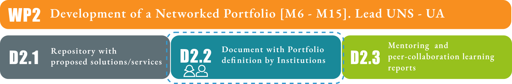
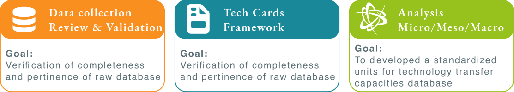
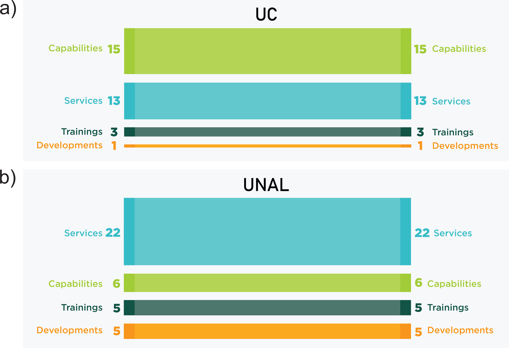
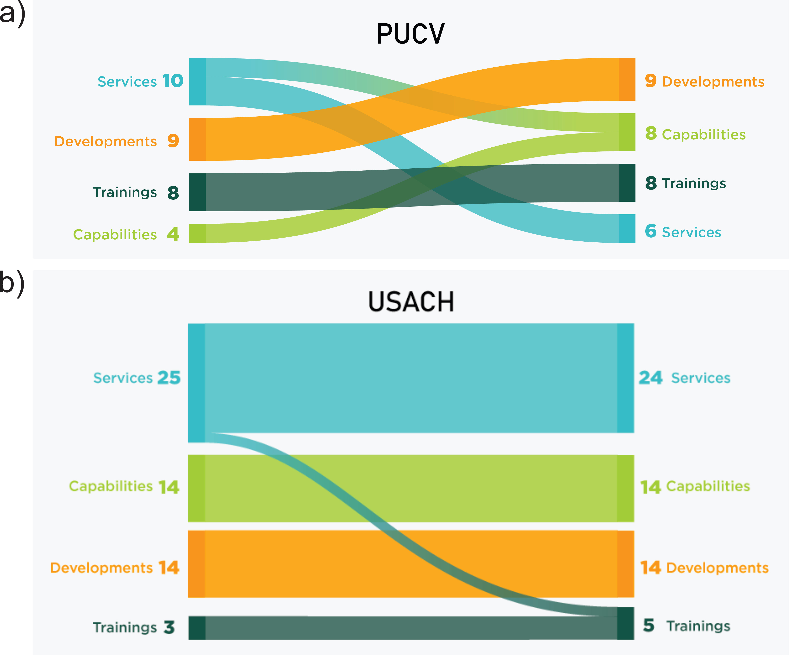
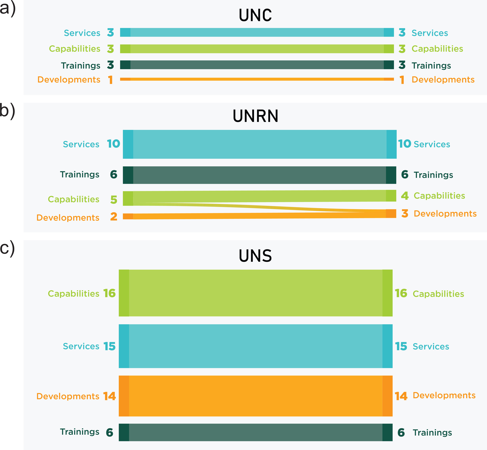
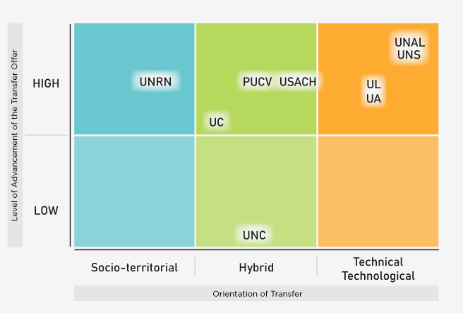

# Executive summary {.unnumbered}

This deliverable presents the **D2.2 Document with Portfolio definition by Institution** of the *Work Package 2 (WP2) Development of a networked portfolio* of the TechTraPlastiCE project.
The development of institutional portfolios within the TechTraPlastiCE project aims to transform the raw information collected in Deliverable 2.1 into structured, validated, and actionable knowledge related to the circular economy of plastics. 
The report focuses on how Higher Education Institutions (HEIs) can organize and communicate their technology transfer capacities, services, developments, and training activities to strengthen collaboration with industry, government, and society.

The methodology combines qualitative, comparative, and multi-level analysis. Information gathered from partner institutions was reviewed, standardized, and validated through the creation of “tech cards,” which serve as harmonized units describing services, capabilities, and innovations associated with the plastics value chain. 
These cards enabled the construction of institutional portfolios that reflect each university’s strengths, orientation, and transfer potential.

The analysis was conducted at three levels: micro (individual transfer records), meso (institutional profiles), and macro (cross-institutional comparison). 
Results reveal diverse but complementary institutional models, ranging from highly technological and infrastructure-based approaches to socio-territorial and sustainability-oriented profiles. 
The report highlights the strategic role of universities as facilitators of sustainable innovation and demonstrates how structured portfolios can enhance visibility, cooperation, and impact within regional and international circular economy ecosystems.

# Introduction

The transition towards a circular economy for plastics requires not only the identification of innovative solutions but also the development of structured mechanisms that enable their effective implementation within specific institutional and territorial contexts. 
In this sense, higher education institutions play a pivotal role as intermediaries between knowledge generation and its application, particularly through their capacity to engage with industry, public institutions, and civil society.

The present deliverable builds upon Deliverable 2.1, which presented the overall methodological framework of WP2 and described the tools and processes implemented for data collection. 
In particular, D2.1 introduced the use of structured questionnaires, complemented by a workshop held in Chile as well as the compilation of the raw data collected from partner institutions.
At this stage, the information was collected but not yet subject to analytical processing. The diversity of institutional capacities, regional contexts, and stakeholder ecosystems across the consortium requires a more tailored and strategic approach to ensure that these offers are not only relevant but also implementable and sustainable. 

Within this context, *the objective of D2.2 is to show the transformation process from this collected information into structured and comparable knowledge. 
This involves the characterization of institutional profiles, the identification of patterns in technology transfer activities, and the construction of institutional service portfolios related to the core of the project, “plastic value chain at the circular economy”*. 
The methodological approach of this deliverable combines qualitative and comparative analysis, enabling the transformation of the information collected in D2.1 into structured and actionable knowledge. 
The approach is organized across three complementary levels of analysis: 
(i) a micro level, focused on the detailed examination of individual technology transfer records; 
(ii) a meso level, oriented toward the aggregation and characterization of institutional profiles; 
and (iii) a macro level, based on comparative analysis across universities, countries, and the consortium as a whole. 

A key element of this process was the constitution of **technology cards** (tech cards from now on), which function as standardized units to organize and systematize the identified capacities, enabling their subsequent aggregation into institutional portfolios. 
Each *service, capability, training activity, or development* identified in the repository (D2.1) was translated into a tech card, ensuring a consistent description in terms of its characteristics, scope, type of activity, and potential application within the plastics value chain. 
This validation and standardization process not only improved the clarity and comparability of the information, but also created a common analytical basis across all partner institutions. 
A central aspect of this process is the recognition that effective technology transfer requires moving beyond fragmented and *ad hoc* interactions towards more structured, visible, and demand-driven service offerings. 

As a result, the tech cards function as the building blocks for the subsequent construction of institutional portfolios, enabling a structured transition from a general inventory of capacities to targeted and actionable service offerings. 
In this sense, universities can improve their capacity to communicate their expertise, engage with external stakeholders, and respond strategically to emerging challenges in the plastic value chain.

{#fig-baseline fig-alt="alt"}

# Methodological Approach

The present deliverable is based on a comprehensive methodological approach that combines qualitative and comparative analysis to examine and structure technology transfer capacities identified within the framework of the circular economy of plastics. 
The overall objective is to transform the information collected in D2.1 into structured and actionable knowledge, enabling: (i) the characterization of institutional profiles, (ii) the identification of patterns and trends in technology transfer activities, and (iii) the development of coherent and operational service portfolios at the institutional level.
The analytical process was structured across three complementary levels:

* **Micro level**: focused on the individual analysis of each tech card, allowing a detailed examination of specific capacities and services.
* **Meso level**: oriented towards the aggregation and analysis at the institutional level, enabling the characterization of each university’s portfolio and transfer profile.
* **Macro level**: based on comparative analysis across universities, countries, and the consortium as a whole, facilitating the identification of broader patterns, complementarities, and strategic opportunities.

This methodological approach responds to the need to move from a descriptive repository of services towards a more analytical and strategic understanding of how universities operate as technology transfer actors within their respective ecosystems.
Through this multi-level analytical framework, the deliverable not only structures institution-specific portfolios but also identifies patterns, trends, and complementarities in technology transfer activities. 
Indeed, this deliverable acknowledges the heterogeneity of the participating institutions and the importance of contextualization. 
In this sense, the methodology not only organizes information but also provides a framework for interpretation, comparison, and decision-making.

Each university operates within a distinct regulatory, economic, and industrial landscape, which influences both the nature of the challenges faced and the opportunities for intervention. 
Therefore, the portfolio definition process is inherently context-sensitive, allowing each institution to prioritize and adapt services according to its specific strengths, strategic objectives, and local stakeholder needs. 
Ultimately, D2.2 represents a key step in bridging the gap between knowledge and action within the TechTraPlastiCE project. 
This multi-level approach ensures both depth and comparability, allowing the analysis to capture the complexity and diversity of technology transfer practices across the consortium by organizing a wide range of potential solutions into structured service portfolios within institutional frameworks.

The work carried out through WP2 reinforces the role of higher education institutions as key actors in advancing a circular economy for plastics at micro, meso and macro level (as illustrated in @fig-method ), increasing their capacity to deliver tangible impacts at regional and international scales. 

{#fig-method width="90%"}

## Data collection, review, and validation

The first stage of the methodological process consisted of a systematic review of the data provided by the partner institutions, included in D2.1 in the annexes. 
All forms submitted by the member universities were individually analyzed, corresponding to technology transfer capacities related to the circular economy of plastics across the four key axes: *services, capabilities, training, and developments*. 
This stage aimed to ensure the quality, reliability, and comparability of the dataset. To achieve this, several tasks were carried out:

* Verification of data completeness and internal consistency,
* Review of the categorization assigned to each entry,
* Identification of inconsistencies and suggestion of reclassification where necessary (e.g., distinguishing between services and capabilities),
* Revision and harmonization of language to ensure clarity, coherence, and accessibility for different types of stakeholders, including non-technical audiences.

This process was essential to reduce ambiguity and heterogeneity in the data, which are common challenges in multi-institutional projects. 
Subsequently, a second validation stage was conducted, involving direct feedback from each partner institution. 
Universities were invited to review, adjust, and confirm the information corresponding to their original submissions with modifications and suggestions made by WP2 members. 
This iterative validation process ensured both internal consistency and alignment with project criteria, while also strengthening institutional ownership of the results.

## Construction of tech cards and institutional portfolios

Based on the validated dataset, tech cards were developed as *standardized units for recording and structuring technology transfer capacities*. 
These cards constitute the core analytical tool of this deliverable, enabling the transformation of heterogeneous information into a consistent and comparable format. 
Each tech card captures key attributes of a given capacity, including its type, scope, orientation, and potential application. This standardization facilitates both the analysis and communication of institutional capabilities.

A total of **303 tech cards** were compiled, representing a broad spectrum of activities across the consortium. 
These tech cards were written in both English and Spanish. From this dataset, institutional portfolios were constructed by organizing the cards according to the type of activity (services, developments, training, and capabilities). 
These portfolios are not conceived as simple inventories, but as structured representations of each institution’s potential contribution to the plastic value chain. They reflect both the diversity and specialization of capacities, providing a foundation for strategic engagement with external stakeholders.

## Institutional-level analysis (micro & meso level)

A systematic and comparative analysis of tech cards (micro level) was performed in order to obtain a detailed examination of specific capacities and services. This analysis also allowed the organization of tech cards according to a set of analytical criteria. This categorization process was essential to transform qualitative information into analyzable variables.

The main criteria included:

* **Type of activity**: services, developments, training, and capabilities,
* **Orientation of the transfer**: technical/technological, social, innovation-oriented, training/educational, or hybrid,
* **Nature of the capacity**: knowledge-based, infrastructure-based, technical assistance, among others.

This multi-dimensional classification allowed the construction of analytical variables that facilitated cross-institutional comparison and pattern identification. Moreover, it enabled the identification of dominant orientations and the balance between different types of activities within each institution.

At the meso level, the analysis focused on the characterization of each university’s profile based on its portfolio of technology transfer capacities. This involved examining the distribution of tech cards by type of activity, the predominant orientation of transfer activities, and the balance between services, developments, capabilities, and training components. This analysis facilitated the identification of institutional trends and strategic orientations. For instance, some universities exhibited a strong focus on service provision and technical assistance, while others demonstrated a strong experience in technological developments or training activities. Based on these patterns, a typology of universities was developed, classifying them according to their dominant transfer profile, such as technical/technological-oriented, social-oriented, innovation-driven, training/educational-oriented, or hybrid. This typology provides a useful framework for understanding institutional roles within the consortium and for identifying potential complementarities.

## Comparative analysis and pattern identification (macro level), and consortium profile analysis

At the macro level, a comparative analysis across universities was conducted to identify patterns and trends at both, country and regional levels. This stage aimed to go beyond individual institutional analysis and capture systemic dynamics within the consortium. The analysis included the comparison of institutional profiles, identification of similarities and differences between portfolios, and detection of areas of specialization and potential complementarities. To facilitate this process, institutions were grouped by country, considering each national context as a cluster. This approach allowed the identification of territorial trends, including common strengths, shared challenges, and potential influences of regulatory, economic, or institutional environments. Such comparative insights are particularly relevant for designing context-sensitive strategies and fostering cross-country collaboration.

Finally, an integrated analysis of all portfolios was conducted to characterize the overall profile of the consortium. This holistic perspective allowed us to identify collective strengths and consolidated areas of expertise across institutions, detect gaps or underrepresented domains that may require further development or strategic reinforcement, and recognize complementarities among institutions, highlighting opportunities for collaboration and synergies within the network. In addition, this comprehensive analysis enabled a better understanding of how different types of transfer capacities, such as services, technological developments, training activities, and capabilities, are distributed and interconnected across the consortium, providing insights into the overall balance and orientation of technology transfer activities.

# Results and discussion

## Form validation

A total of 303 forms were received (per language, Spanish and English) from the partner universities, distributed across four main axes: services, capabilities, developments, and training. These forms represent the initial dataset describing the technology transfer capacities of the partner institutions within the framework of the circular economy of plastics.

Following a detailed review and analysis of the submitted forms, a subset of entries was reassigned to a different category. This reclassification process was necessary to ensure consistency in the categorization criteria, as some submissions presented overlaps or ambiguities between categories. The reassignment was carried out based on a standardized set of definitions and classification guidelines established within the work package, aiming to improve the comparability and analytical robustness of the dataset. This validation stage played a key role in enhancing the overall quality and reliability of the information, allowing for a more accurate representation of institutional capacities. It also contributed to harmonizing the interpretation of categories across partner institutions, which is particularly relevant in a multi-country and multi-institutional context.

Figures 1-4 present the distribution of forms across the four dimensions for each university, separated by regions, within the consortium. Additionally, when applicable, it indicates the number of forms that were reassigned from their original category, providing transparency regarding the adjustments made during the validation process. This structured and validated dataset constitutes the basis for the subsequent construction of technology cards and the development of institutional portfolios, ensuring that the analysis is grounded on consistent, comparable, and high-quality information. 

Based on the verification of the information provided, a brief analysis is presented below, highlighting the main suggestions and modifications made to the original data prior to its validation by each institution. This analysis focuses on identifying the most relevant adjustments carried out during the data review process, including improvements in categorization, clarification of descriptions, and alignment with the established criteria of the project. The purpose of these modifications was to enhance the consistency, clarity, and comparability of the information across all partner institutions. The revised data was subsequently shared with each university for validation, allowing them to review, confirm, and, where necessary, refine the proposed changes. This iterative process ensured that the final dataset accurately reflects the institutional capacities while maintaining coherence with the overall methodological framework of the deliverable.

From the comparison between the initial and final distribution of forms across the four dimensions (@fig-CO - @fig-EU ),  different patterns of adjustment among regions and institutions can be observed, reflecting varying levels of consistency in the original data classification. In the case of the Colombian universities (@fig-CO), UC and UNAL, no differences were observed between the initial and final distributions in any of the dimensions. 
All categories remained unchanged, indicating that no reassignment, removal, or adjustment was required during the validation process. This stability suggests a high level of coherence in the original classification of the forms and an adequate understanding of the methodological criteria from the outset. 

{#fig-CO width="80%" fig-align="center"}

A different situation is observed in the Chilean universities (@fig-CH), where the most significant adjustments took place. In the case of PUCV, a clear reassignment process was identified, with four forms being reclassified from Services to Capabilities (Services: 10 to 6; Capabilities: 4 to 8), while Developments and Trainings remained unchanged. This indicates an initial ambiguity in the distinction between service provision and institutional capacities, which was resolved during the validation process. For USACH, the adjustments involved both data cleaning and reassignment. Services decreased from 25 to 24 due to the removal of a duplicated form, while Trainings increased from 3 to 5 since 2 services were also potential training courses. Capabilities and developments remained stable at 14, indicating consistency in this dimension.

{#fig-CH width="80%" fig-align="center"}

Regarding the Argentinian universities (Figure 3), most institutions showed a high level of stability. Both UNC and UNS presented no changes between the initial and final distributions, confirming the consistency of their original classifications. In contrast, UNRN exhibited a minor adjustment, with one form being reassigned from Capabilities to Developments (Capabilities: 5 to 4; Developments: 2 to 3), while the remaining dimensions remained unchanged. This represents a targeted refinement rather than a structural inconsistency.

{#fig-AR width="80%" fig-align="center"}

Finally, in the case of the European universities (@fig-EU), UL and UA, no reassignment processes were identified, and the distributions remained unchanged after validation. This indicates that the initial categorization was fully aligned with the methodological framework.

Furthermore, opportunities for improvement were identified in the descriptive quality of the forms. In several cases, it was necessary to clarify the information provided to ensure a consistent interpretation across institutions. This included the reformulation of descriptions, the incorporation of missing technical details, and the removal of redundancies, contributing to greater clarity and comparability of the data. Another significant adjustment was related to aligning the content with the methodological criteria of the project. 
This involved reviewing the relevance of each form within the established conceptual framework, ensuring that all records met the standards defined for the development of technology cards and institutional portfolios.

This validation process, combining reassignment, clarification, and data cleaning where necessary, ensured the consolidation of a robust, coherent, and comparable dataset across all partner institutions, providing a reliable basis for the subsequent development of technology cards and institutional portfolios.

{#fig-EU width="80%" fig-align="center"}

## Tech Cards

@fig-tech presents the structure of the tech cards that constitute the analytical foundation of this deliverable and enable the structuring of each institution’s technology transfer offer in comparable terms. 
For this reason, the way in which information is presented within each card is key to facilitating its readability and interpretation. 
The  @fig-tech illustrates the templates used for the development of the tech cards considering the visual identity of TechTraPlastiCE

{#fig-tech width="100%" fig-align="center"}

As can be observed in @fig-tech, the design of the tech cards is consistent across all cases, incorporating a color-coded identification system according to each thematic axis. This approach ensures visual coherence throughout the set while facilitating the rapid identification of information by the user.
Based on the information collected from the forms, a format was developed to synthesize and organize the content clearly within a single page. 
Initially, the possibility of developing an individual web page for each card was considered. 
However, given the number of cases and the available timeframe, a downloadable `PDF` format was selected. 
This format ensures accessibility, portability, and ease of dissemination through different communication channels.

The design is structured around four colors, one for each axis (Capabilities, Developments, Services, and Training), defined in alignment with the project’s visual identity. 
Each technology card features a header with the corresponding color, accompanied by the name of the axis and a representative icon. In terms of visual hierarchy, the title is prioritized as the main element, followed by a subtitle that expands on the information. 
A representative image is also included to complement the content, along with a brief description summarizing the development, service, training activity, or capacity presented. 
On the side section, highlighted with a color-coded background, keywords and contact information are displayed, allowing quick access to relevant details. At the bottom of the card, the project’s institutional logos are included, along with references to the website and social media channels, ensuring traceability and connection with the broader project ecosystem.

During the design process, several exchange and feedback sessions were conducted with the team from UNRN, leaders of WP5, which enabled the incorporation of improvements and validation of the proposed format. As a result of these interactions, additional elements were integrated, such as the institutional identification (logo) of each participating university and the inclusion of the corresponding national flag, both positioned at the top of the card. 
Furthermore, the inclusion of clickable links within the PDF format was considered, allowing direct access to institutional and project websites, thus enhancing usability and interactivity. 
Regarding visual identity, the color palette was refined to align with the project’s guidelines, defining the following colors for each axis: 
Capabilities (#9BC53D \textcolor{Verde}{\scalebox{1}{$\blacksquare$}}), Developments (#F8961E \textcolor{Naranja}{$\blacksquare$}), Services (#1F8A9C \textcolor{Celeste}{$\blacksquare$}), and Training (#2F5D50 \textcolor{Verde_osc}{$\blacksquare$}). 

Finally, the system for developing the tech cards was based on an editable PowerPoint template. In an initial stage, this template was designed to establish a common structure, defining criteria for visual hierarchy, information organization, and graphic guidelines. In a second stage, different members of WP2 used this template to complete the content of each tech card based on the information collected from the forms. This workflow allowed the distribution of tasks among teams while ensuring consistency in structure, visual coherence, and the accurate integration of content and links.

## Portfolios

@fig-techcards shows the set of tech cards constituted the basis for the construction of the institutional portfolios of each participating university, which can be accessed through the following link: [https://techtraplastice.eu/resultados/](https://techtraplastice.eu/resultados/). 

](figures/2.2/Tech-cards-00.jpg){#fig-techcards width="80%" fig-align="center"}

Based on this material, a presentation strategy was defined to ensure accessibility, intuitive navigation, and scalability of the system. 
Initially, the possibility of organizing the repository according to the four thematic axes was considered; however, it was ultimately structured around the institutions, prioritizing a user-centered approach focused on the profile of each university. Accordingly, an initial interface was designed as the main entry point to the system, presenting a list of the participating universities. By accessing each institution, its specific portfolio is displayed, internally organized according to the four axes (*Training, Services, Developments, and Capabilities*). 
Each axis is identified through its corresponding color code, which also functions as a filtering criterion for the visualization of the tech cards. 
These are arranged in a modular grid of four columns, with a variable number of rows depending on the volume of information available for each institution. 
This layout enables an organized, comparable, and scalable reading experience across different levels of content.

Although the initial proposal considered the development of an individual web page for each card, the scale of the project and the implementation timeline led to a redefinition of this strategy. 
Instead, a system based on downloadable PDF files was adopted. In this way, each card can be viewed and downloaded directly from the interface, ensuring its portability and independent dissemination. 

The interface design was initially prototyped in Figma by the UNS team and later shared with the UNRN team, responsible for implementing the repository within the results section of the project’s official website. 
This collaborative process enabled the translation of the conceptual and graphic guidelines defined during the design phase into a functional solution aligned with the project’s communication and accessibility objectives.

## Institutional analysis (micro and meso level)

Based on the analysis of the tech cards, institutional profiles were defined for each of the participating universities. 
In this process, patterns were identified in the orientation of technology transfer activities, with particular emphasis on differences in the content of the tech cards, the predominant types of transfer (services, development and training), and the levels of maturity and complexity of the identified capacities, understood as the set of resources and competencies encompassing the various transfer mechanisms or modalities. 

These capacities were also examined according to their characteristics, which made it possible to highlight different institutional approaches to conceptualising and implementing technology transfer. 
This analysis not only enables a detailed characterisation of each institution, but also allows for the identification of common trends and significant differences among them. Additionally, these results were addressed from a comparative perspective, in order to understand the diversity of existing approaches and to identify potential complementarities among the institutions that constitute the consortium.

### Segmentation of institutional profiles

Based on a comprehensive analysis considering the total set of tech cards collected across all participating universities, five transfer profiles were identified, reflecting different forms of engagement with the environment:

* **Technical/technological profile**: characterised by the generation and application of scientific and technological knowledge aimed at addressing productive challenges. It includes developments, testing, materials characterisation and technological services, with varying levels of maturity.
* **Social profile**: oriented towards addressing territorial, social and environmental challenges, with an emphasis on engagement with local stakeholders, sustainability and capacity building within the territory.
* **Innovative profile**: focused on promoting innovation processes, including activities related to innovation management, business model development, organisational transfer and the articulation among different actors within the system.
* **Educational/training profile**: focused on capacity building, training and knowledge dissemination through courses, workshops and educational activities aimed at strengthening capacities across different target groups.
* **Hybrid profile**: characterised by a balanced combination of different knowledge transfer functions, integrating technical/technological, social, innovative and educational activities, without a clear predominance of any single one. 
This profile reflects a diversified institutional strategy, where technological services, developments, training and territory-oriented actions coexist, articulating multiple mechanisms of engagement with the environment.

This typology, developed through a comprehensive approach, also enables the identification of recurring patterns, consistent trends and shared criteria in transfer activities, going beyond the individual specificities of each institution.

## Profile definition

In this section, the analysis and results for each university are presented, considering the structure and content of their portfolios. The approach is organised in a descriptive manner, focusing on the content, orientation and level of advancement of technology transfer activities, to characterise the institutional profile of each university. 
Within this framework, capacities are considered as a cross-cutting element of the analysis, as they represent the set of institutional resources and competencies that underpin and encompass the different types of transfer, including technical services, training and technological developments. 

The main results of the institutional analysis for each of the member universities are presented below, based on the application of the previously defined transfer profile typology.

### Universidad Central (UC) - Colombia

The profile of the Universidad Central (@fig-UC) was analysed based on 33 technology cards, including 16 capacities forming the knowledge and infrastructure base supporting different types of transfer. These include 13 technical services, 3 training activities and 1 technological development.

](figures/2.2/UC.png){#fig-UC width="60%"}

The analysis shows a high relative concentration of technical services, which constitute the core of the activities, while training and technological developments have a significantly lower presence. 
Capacities encompass both technological dimensions, such as materials characterisation, polymer analysis, instrumentation development and process optimisation, and organisational and management aspects, including intellectual property, waste management models, life cycle analysis, public policy evaluation and knowledge management. 
Technical services operationalise these capacities through testing, materials validation, prototype development, equipment maintenance, market studies, technology watch and decision-support activities.

Transfer activities show an integrated approach, combining technological capacities with management tools, organisational innovation and sustainability. Compared to more strictly technological profiles, the Universidad Central significantly incorporates components related to circular economy, inclusion of territorial actors such as recyclers, and public policy analysis. Based on these elements, *UC can be classified as a hybrid profile with a socio-technical orientation*.

### Universidad Nacional de Colombia (UNAL)

The profile of the Universidad Nacional de Colombia was analysed based on 38 technology cards (@fig-UNAL). Within this set, 6 capacities define the institutional knowledge core. These support 22 technical services, 5 training activities and 5 technological developments.

](figures/2.2/UNAL.png){#fig-UNAL width="60%"}

Technical services predominate, representing more than half of the activities, followed by training and developments. Services include a wide range of testing and characterisation techniques for polymeric materials, such as thermal, mechanical and physicochemical analyses, along with advanced methodologies including chromatography, microstructural analysis and durability assessment.
Capacities also incorporate a strategic dimension linked to sustainability, circular economy, process scaling and materials characterisation. Training activities reinforce this approach through courses on life cycle analysis, eco-design and innovation. Technological developments focus on bioeconomy and resource valorisation, including biopolymers, bio-based plasticisers and biodegradable packaging, some reaching intermediate to advanced maturity levels (up to TRL 7).

Transfer activities show a technological–applied orientation with a strong environmental focus. Based on this, *UNAL can be classified within a technical/technological profile with a service-oriented and environmental focus*.

### Pontificia Universidad Católica de Valparaíso (PUCV)

@fig-PUCV presents the profile of Pontificia Universidad Católica de Valparaíso was defined based on the analysis of a total of 31 tech cards, including: 6 technical services, 8 capacities, 8 training activities and 9 technological developments. It is worth noting that the identified capacities constitute the foundation upon which the different types of transfer are articulated, integrating and supporting service, training and development activities.

](figures/2.2/PUCV.png){#fig-PUCV width="60%"}

In terms of distribution, a relatively balanced structure is observed across the different types of activities, with a slight predominance of technological developments and training activities, while technical services have a lower relative proportion. 
In particular, services include laboratory testing, environmental consultancy, energy audits, project formulation and incubation processes, while training activities comprise diploma programmes and courses focused on innovation, sustainability and applied technologies. 
Technological developments mainly correspond to prototypes and solutions at early stages of technological maturity (TRL 2 to 4), primarily in the fields of materials, recycling and waste management.

The balance among activity types reflects a diversified configuration, in which knowledge generation, service provision, training and technological development coexist, suggesting an institutional strategy not specialised in a single transfer mechanism. 
Based on these elements, *PUCV can be classified as having a hybrid profile, as it combines different transfer functions in a balanced manner, integrating technical, educational, innovative and engagement-oriented capacities*.

### Universidad de Santiago de Chile (USACH)

The profile of the Universidad de Santiago de Chile (@fig-USACH) was determined based on 57 tech cards (14 capacities, 24 technical services, 14 developments and 5 training activities), indicating a diversified structure with a predominance of services.

](figures/2.2/USACH.png){#fig-USACH width="50%"}

Capacities focus on the development of innovation tools, organisational management and sustainability, integrating technical and strategic dimensions for solution design. In this sense, they function as a conceptual and methodological support enabling the deployment of consultancy services, company support processes and training activities, rather than as a direct basis for highly complex technological developments. Accordingly, technical services are primarily oriented towards planning, optimisation and evaluation of productive and organisational systems, incorporating modelling tools, environmental analysis and innovation management. Technological developments cover areas such as energy, recycled materials and circular economy, with intermediate maturity levels (TRL 2–5). Training activities complement the offer with courses in circular economy, innovation and agile methodologies, supporting the adoption of these tools.

Overall, transfer activities show a hybrid orientation, combining technological components with a strong focus on management, innovation and sustainability. A balance is observed between services, development and training activities, although with a lower level of technological maturity compared to more industrially oriented profiles. Therefore, *USACH can be classified as a hybrid profile with an innovation orientation, characterised by the articulation between management tools, technological development and support for productive transformation processes*.

### Universidad Nacional de Córdoba (UNC)

The profile of the Universidad Nacional de Córdoba was constructed based on 10 technology cards, including 3 capacities, 3 technical services, 3 training activities and 1 technological development as illustrated in @fig-UNC. 

](figures/2.2/UNC.png){#fig-UNC width="60%"}

The portfolio shows a balanced structure between technical services and training, with a lower presence of technological developments. However, training activities have a relatively strong weight, indicating an institutional orientation towards knowledge generation and dissemination in sustainability, circular economy and emerging economic models.

Capacities are focused on polymer processing and characterisation, while services provide support in thermal, mechanical and biodegradability analyses. Training activities include diploma programmes and courses with multidisciplinary approaches. A single technological development was identified, related to biodegradable materials from cellulose at an early maturity level (TRL 4). Based on these elements, *UNC can be classified as a hybrid profile with a technical–social orientation*.

### Universidad Nacional de Río Negro (UNRN)

The profile of the Universidad Nacional de Río Negro (@fig-UNRN) was analysed based on 21 technology cards, including 4 capacities, 9 technical services, 5 training activities and 3 technological developments, indicating a relatively balanced structure.

](figures/2.2/UNRN.png){#fig-UNRN width="50%"}

Capacities show an integrated approach to sustainability and circular economy, with strong emphasis on inclusive recycling systems and interdisciplinary solutions for microplastics. These underpin technical assistance services, training, and developments, with strong territorial anchoring and engagement with local stakeholders and public policies. Technical services differ from those of other institutions, focusing on organisational consultancy, strategic planning, human resource management and environmental diagnostics. Technological developments address environmental challenges such as microplastic detection sensors, microbial consortia for polymer biodegradation and environmental management plans.

Its transfer activities show a predominantly socio-environmental orientation with strong territorial anchoring. *UNRN can be classified within a social profile with a management and sustainability orientation*.

### Universidad Nacional del Sur (UNS)

The profile of the Universidad Nacional del Sur (@fig-UNS) was analysed based on 51 technology cards, including 16 capacities, 14 developments, 15 technical services and 6 training activities, showing a highly balanced and comprehensive structure.

](figures/2.2/UNS.png){#fig-UNS width="60%"}

Capacities reflect strong expertise in process engineering, materials science and advanced modelling, including polymer synthesis and processing, bioplastics design, process optimisation and environmental assessment. Technological developments are a central component, with applications in packaging, recycling, energy and advanced materials, spanning various maturity levels from experimental validation to real-world implementation. Technical services are highly specialised and supported by advanced analytical infrastructure, enabling materials characterisation, quality control and product validation. Training activities complement the portfolio through advanced technical education.

The transfer activities show a clearly technological–industrial orientation, focused on materials, processes and waste valorisation, with strong links to the productive sector. Based on this analysis, *UNS can be classified within a technical/technological profile with a strong orientation towards innovation and transfer*.

### Universidade de Aveiro (UA)

The profile of the Universidade de Aveiro (@fig-UA) was established based on the analysis of 29 tech cards, distributed as follows: 12 technical services, 13 capacities, 3 training activities and 1 technological development. 
As with the other institutions, the identified capacities constitute the core of the transfer offer, concentrating technical knowledge and available infrastructure, from which services, training activities and, to a lesser extent, technological developments are structured and deployed.

](figures/2.2/UA.png){#fig-UA width="60%"}

In this case, a high relative number of technical services is observed, while training activities and, especially, technological developments have a significantly lower proportion. Capacities are mainly oriented towards advanced materials characterisation (mechanical, thermal, structural, optical and morphological) and processing technologies such as extrusion, compounding, 3D printing and injection moulding. Technical services operationalise these capacities in applied settings, offering testing, materials validation, process optimisation and sample production at laboratory and pilot scale. Regarding transfer orientation, a predominantly technological–operational approach is evident, supported by the infrastructure available and the provision of specialised services to the productive sector. Training activities, although present, are focused on specific topics such as bioplastics, sustainability and innovation, while technological developments are limited to a single proposal with an intermediate maturity level (TRL 6), related to materials recycling.

In this context, a structure with limited diversification in transfer mechanisms is observed, with clear specialisation in the generation of scientific capacities and their application through technical services, and a lower orientation towards technological development. Based on these elements, *UA can be classified within a technical/technological profile*.

### Université de Lorraine (UL)

The profile of the Université de Lorraine (@fig-UL) was determined based on the analysis of 33 tech cards. Within this set, 7 capacities were identified, forming the scientific and infrastructural basis supporting the other types of transfer. These include 17 technical services, 7 training activities and 2 technological developments.

The composition shows a clear predominance of technical services, which represent the main component of the identified activities, followed by training activities, while technological developments have a more limited presence. Technical services are primarily oriented towards advanced characterisation of polymeric materials, including chemical, structural, morphological, rheological and mechanical analyses, as well as manufacturing processes, prototyping, material formulation and specialised consultancy. 

](figures/2.2/UL.png){#fig-UL width="60%"}

Capacities reflect a consolidated scientific infrastructure focused on polymer characterisation and processing, with emphasis on understanding structure–property–process relationships. Training activities complement this framework through a broad and structured educational offer, ranging from specialised short courses to full engineering programmes, showing strong integration between academic training and applied research. Regarding transfer orientation, a strongly scientific–technological approach is observed, based on the generation of advanced knowledge and its application through highly specialised services. Technological developments are positioned at intermediate maturity levels (TRL 4), indicating a focus on experimental validation and proof of concept. 

The structure is relatively diversified but clearly specialised in high-level technical services, strongly supported by scientific capacities and a consolidated training offer. *Based on these elements, UL can be classified within a technical/technological profile.*

## Comparative analysis of the profiles of each university (macro level) and definition of the consortium profile

The macro-level analysis focused on the aggregation and characterisation of the institutional portfolios of the participating universities, based on the set of tech cards collected in each case. 
This approach made it possible to identify patterns in the structure, orientation and level of development of transfer activities, as well as differences in institutional strategies for engagement with the environment. 
Within this framework, capacities are recognised as the structuring element of the portfolios, as they concentrate the knowledge, infrastructure and institutional competencies from which technical services, training activities and technological developments originate and are deployed. Thus, the differences observed among institutions largely reflect the nature, scope and orientation of these capacities.

In general terms, a high degree of heterogeneity is observed in the composition of the portfolios, both in the distribution across activity types and in the level of technological maturity. Nevertheless, three main institutional configurations can be identified. On the one hand, there are institutions with a technical/technological profile, where capacities are strongly anchored in scientific and experimental capabilities supported by advanced infrastructure. In these cases, technical services constitute the main transfer mechanism, operationalising these capacities through testing, materials characterisation and support to industrial processes, while technological developments complement this with varying levels of maturity. Secondly, institutions with a social orientation are identified, where capacities are structured around environmental, social and sustainability-related challenges. In these contexts, services take the form of technical assistance, consultancy and support to territorial actors, while training activities play a central role in local capacity building and technological developments are oriented towards context-specific solutions.
Finally, institutions with hybrid profiles are identified, characterised by a balanced configuration between services, developments and training. In these cases, capacities act as an integrative support, enabling both service provision and the development of technological solutions and management tools, combining technical, organisational and innovation components.

In addition, the analysis of institutional profiles allowed the identification of patterns across two key dimensions: on the one hand, the orientation of transfer, which ranges from technological–industrial approaches to socio-territorial ones; and, on the other hand, the level of development of transfer activities, linked to the degree of consolidation of capacities and their deployment in services and technological developments. 
This approach contributes to a deeper understanding of the differences among institutions and enriches the interpretation of the identified profiles. Furthermore, the analysis of technological maturity levels reveals significant differences among institutions, ranging from early-stage validation developments to technologies implemented in real environments, reflecting different degrees of consolidation of transfer systems.

In order to synthesise these differences, the matrix presented in @fig-comp was developed, allowing the relative positioning of universities to be represented based on two dimensions: the orientation of transfer and the level of advancement of the transfer offer. The first dimension, represented on the horizontal axis, expresses a continuum ranging from socio-territorial approaches, focused on engagement with local actors, sustainability and capacity building in the territory, to technological approaches oriented towards the development of applied solutions and engagement with the productive sector. The vertical axis reflects the quantity and level of advancement of the transfer offer, considering both the degree of development and consolidation of institutional capacities and the technological maturity of developments.

{#fig-comp width="85%" fig-align="center"}

As expected, based on the previous analyses, the matrix allows the visualisation of differences among universities and highlights the coexistence of multiple transfer strategies. It also reflects different levels of maturity, consolidation and institutional orientations of the transfer offer, contributing to a more comprehensive understanding of the diversity of profiles within the consortium. Furthermore, by incorporating a comparative perspective by country and region, additional trends are identified that reinforce and complement the institutional analysis.

In Colombia (Universidad Central and Universidad Nacional de Colombia), an articulation between technological capacities and approaches oriented towards sustainability and the circular economy is observed, with a strong presence of technical services. However, differences in orientation can be identified: while UNAL presents a more technological profile, Universidad Central places greater emphasis on socio-territorial and management dimensions, resulting in hybrid profiles with different levels of development. 

In Chile (PUCV and USACH), portfolios are characterised by diversification and a significant presence of services and training activities, accompanied by technological developments at intermediate maturity stages. Capacities are mainly oriented towards innovation, sustainability and management, leading to hybrid profiles with an emphasis on engagement with the productive sector and support to innovation processes.

In Argentina (UNS, UNC and UNRN), greater institutional heterogeneity is observed. UNS presents a consolidated technical/technological profile, with strong integration between capacities, services and developments at different maturity levels. In contrast, UNRN shows a social profile, with strong anchoring in sustainability and engagement with local actors. UNC is positioned in an intermediate point, with a hybrid profile and a technical–social orientation.

Finally, in Europe (Université de Lorraine and Universidade de Aveiro), technical/technological profiles predominate, with a strong emphasis on consolidated scientific capacities and the provision of specialised technical services. In these cases, transfer is primarily structured around advanced infrastructure and experimental knowledge, with a lower relative weight of technological developments and a clear orientation towards industrial support.

The macro-level analysis shows that, although all institutions deploy multiple transfer mechanisms, there are dominant logics associated with their capacities that shape differentiated profiles according to their orientation, level of development and institutional context. This level is key to understanding the identity of each university in terms of transfer and its relative positioning within the consortium, as well as to identifying opportunities for articulation and complementarities.

# Conclusions

This deliverable represents a key step in transforming the initial dataset collected in D2.1 into structured, validated, and actionable knowledge within the framework of the TechTraPlastiCE project. 
Through a systematic process of data review, validation, and standardization, the information provided by partner institutions was consolidated into a coherent and comparable dataset, ensuring its reliability and analytical robustness. 
The development of tech cards as standardized units enabled the organization of diverse institutional capacities into a consistent format, facilitating both analysis and communication. Building upon this, institutional portfolios were constructed, moving beyond a simple inventory of activities towards structured representations of each university’s potential contribution to the plastic circular economy.

The multi-level methodological approach (micro, meso, and macro) allowed not only the detailed characterization of individual capacities and institutional profiles but also the identification of broader patterns, complementarities, and strategic opportunities across the consortium. This analysis highlighted the diversity of transfer approaches, ranging from technical/technological to socio-territorial orientations, as well as hybrid configurations that integrate multiple functions. Overall, the results demonstrate that higher education institutions play a critical role as enablers of the circular economy for plastics, with differentiated but complementary capacities. By structuring these capacities into accessible and strategic service portfolios, this deliverable strengthens the ability of universities to engage with external stakeholders, respond to real-world challenges, and generate impact at both regional and international levels.
