```{r setup, include=FALSE, echo=FALSE}
knitr::opts_chunk$set(echo = FALSE, fig.retina = 3, message = FALSE, warning = FALSE)
options(knitr.kable.NA = '')

library(tidyverse)
library(kableExtra)
library(readxl)
library(here)

```


# Introduction

Building on the results of D2.1 and D2.2, which enabled the structuring of institutional portfolios and the characterization of technology transfer capacities across the consortium universities, this deliverable focuses on activating these capacities through *cross-peer collaboration and mentoring processes among partner institutions*. 
While D2.2 provided a structured and comparable understanding of institutional strengths, profiles, and transfer orientations, the effective implementation of these portfolios requires moving beyond individual institutional analysis towards joint and collaborative dynamics. 
In this context, HEI are not only knowledge providers but also active participants in shared learning processes, where experiences, methodologies, and practices can be transferred and adapted across different institutional and regional contexts.

Within this framework, D2.3 aims to foster cross-peer collaboration and mentoring activities that enable more experienced partners to share practices related to the delivery of solutions, services, and methodologies for portfolio implementation. 
This process seeks to create matching opportunities among institutions, allowing them to advance according to their specific needs, capacities, and strategic priorities. 
To support this process, an External Advisory Board (EAB) was established, composed of experts selected through a collaborative process among partner institutions. Each university proposed professionals with relevant experience aligned with the focus of the project, ensuring a diverse and complementary set of perspectives in areas such as technology transfer, innovation, sustainability, and industry engagement.

The present deliverable presents an integral analysis of the portfolios, member profiles, and EAB perspectives, in order to combine internal reflection, collective analysis, and external feedback. This analysis allowed to identify complementarities, shared challenges, and opportunities for collaboration. 
In this sense, D2.3 contributes to bridging the gap between structured knowledge (institutional portfolios) and actionable collaboration, reinforcing the role of the consortium as a dynamic network capable of co-developing solutions and scaling impact in the field of plastic circular economy.

# Methodological Approach

The methodological approach adopted in this deliverable is based on a participatory, qualitative, and iterative process aimed at fostering peer-learning, mentoring, and collaboration among partner institutions. 
It integrates internal analysis, collective reflection, and external validation to support the transition from institutional portfolios to collaborative implementation strategies.


## Canvas-based institutional analysis

As it was presented in D2.1, a key activity was conducted during the consortium meeting held in Chile during November 2026, where the nine partner universities participated in a structured exercise based on the canvas methodology. 
his activity aimed to map institutional capacities related to knowledge and technology transfer and to identify opportunities for inter-university collaboration.

The exercise was structured around eight analytical blocks: 

1. Human and organizational capacities, 
1. Infrastructure and equipment, 
1. Applied R&D results, 
1. Technological services and developments, 
1. Training and education, 
1. Institutional engagement strategies, 
1. Barriers and opportunities, and 
1. Inter-university collaboration opportunities

Guiding questions (@fig-canva) were used to stimulate reflection on institutional strengths, available resources, transfer potential, interaction mechanisms with external stakeholders, and key challenges. 
While blocks 1 to 7 informed the characterization of institutional profiles (submitted via the Google Forms described in D2.1 and analyzed in D2.2), **block 8 focused specifically on identifying complementarities and opportunities for collaboration. This component was further developed through a dedicated follow-up form completed by each institution.**

{#fig-canva width="100%" fig-align="center"}

In addition to the canvas-based mapping exercise, a complementary perspective mentoring based on *open innovation* was incorporated through a subsequent virtual session at the general meeting of the consortium in December 2066.
This approach aimed to enrich the analytical framework by introducing collaborative and co-creation dynamics as a key dimension of technology transfer processes from the presential meeting made at Chile in Nov. 2026 (See the presentation in the Annex). 

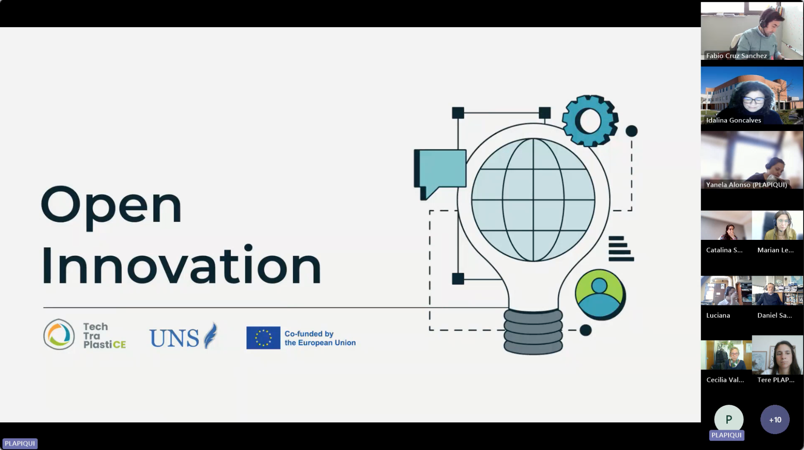{#fig-open width="95%" fig-align="center"}

From a methodological standpoint, the integration of open innovation allowed to move beyond a static identification of institutional capacities towards a more dynamic understanding of how these capacities can be mobilized, in interaction with external stakeholders. 
In particular, it introduced a shift from linear models of technology transfer (based on predefined demands) towards iterative and collaborative processes, where problems and solutions are jointly defined and developed. 
As a result, the combined use of the canvas methodology and the open innovation perspective provided a more comprehensive framework to analyze not only what institutions can offer, but also how these capacities can be articulated within collaborative ecosystems, both within the consortium and in relation to external actors.


## External Advisory Board workshop and structured exchange

A second core component of the methodology was the interaction with the EAB.
During the second semester of 2026, the members of the EAB made a official presentation to the TechTraPlastiCE consortium on topic related to the technology transfer and Circular Economy.
Then, a virtual workshop with most of the EAB was carried out through on March 26th, 2026. 
The composition of the EAB reflects the diversity of expertise required to address technology transfer challenges within the circular economy of plastics, combining academic, industrial, and strategic perspectives. The workshop aimed to deepen the understanding of institutional barriers and opportunities, and to obtain strategic recommendations for strengthening technology transfer practices.

The session was structured into four blocks:

* Contextualization of the project and institutional environments,
* Short presentations by each university based on a structured pitch format,
* Guided discussion with EAB members to identify patterns, differences, and opportunities and,
* Final synthesis with strategic recommendations.

Each institution presented its context, key challenges, and planned actions for the following 12 months, focusing on implementation strategies rather than descriptive reporting.

## Identification of complementarities and matching opportunities

The combination of the canvas analysis and the EAB workshop enabled the identification of complementarities across institutions, forming the basis for cross-peer collaboration and mentoring.

The analysis focused on:

* Identifying areas of affinity (shared thematic interests),
* Detecting complementarities (where capacities can be combined) and,
* Recognizing potential mentoring dynamics based on different levels of experience and maturity.

This approach allowed the transition from individual institutional portfolios to a network-based perspective, where collaboration is understood as a key mechanism for enhancing the effectiveness and scalability of technology transfer activities.


# Results and Discussion

## External Advisory Board participation 

As part of the cross-peer learning and validation process, an EAB was established during 2025 (*c.f. D6.1. Quality assurance plan*), composed of experts with relevant experience in technology transfer, innovation, sustainability, and industry engagement. 
The members of the EAB were proposed by the partner institutions, ensuring a diverse and complementary representation aligned with the focus of the project. The EAB played a key role in providing external insights, identifying common challenges across institutions, and contributing strategic recommendations to strengthen the implementation of institutional portfolios. 

### Ferran Giones

Deputy Director of the Institute for Entrepreneurship and Innovation Science (ENI) at the University of Stuttgart (Germany), and has previously served as Adjunct Professor of Technological Entrepreneurship at the University of Southern Denmark (SDU). His expertise centers on technological entrepreneurship and the processes underlying industrial emergence, with a particular focus on the interplay between startups, established firms, and emerging technologies. His work also addresses the commercialization of scientific knowledge, examining how new technologies are translated into viable applications. In addition, he has developed contributions in the field of technological exaptation, analyzing how existing technologies are repurposed within innovation strategies across both entrepreneurial ventures and established organizations.


### María José Zapata

Associate Professor at the Faculty of Economics, Law and Business at the University of Gothenburg since 2017. Her expertise lies in the foundations of sustainability, with a particular focus on the design and governance of public–private partnerships, the organizational dimensions of sustainability, and the structuring of environmental sustainability initiatives in urban contexts. Her work addresses how institutions coordinate, manage, and implement sustainability strategies, contributing to a deeper understanding of governance models and collaborative mechanisms for sustainable urban development.


### Astrid Jaime - Associate Researcher at the Universidad Minuto de Dios in Colombia 

At the monthly general consortium of TechTraPlastiCE of Oct. 2026, Prof. Jaime presented her expertise research on innovation project management, knowledge transfer processes, entrepreneurship, and intellectual property as illustrated @fig-UIS. 
She has extensive experience in teaching and outreach activities related to these fields, contributing to the dissemination and application of knowledge. 
THe TechTraPlastiCE consortium could have on overview of her work which is centered on the articulation of science, technology, and innovation systems, with a particular focus on knowledge management and its role in strengthening institutional and socio-productive linkages.

:::{layout="[45,-5,45]"}

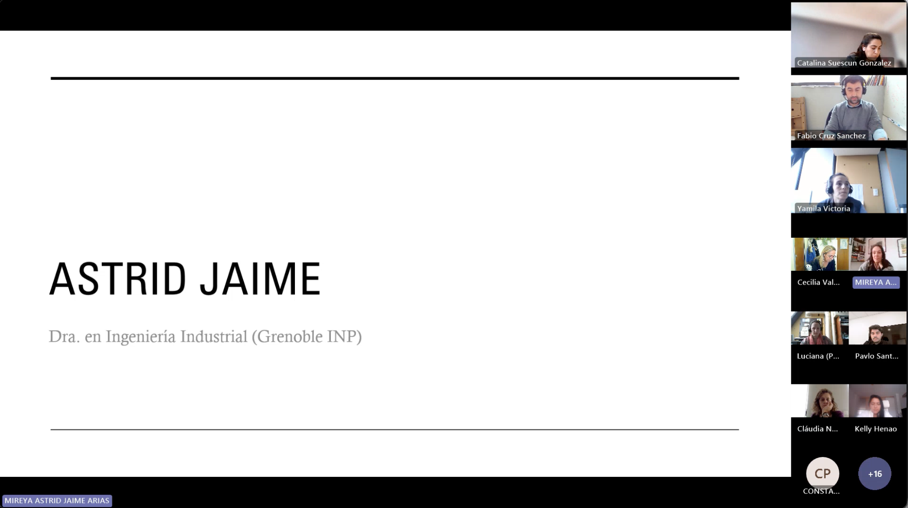{#fig-id fig-alt="alt"}

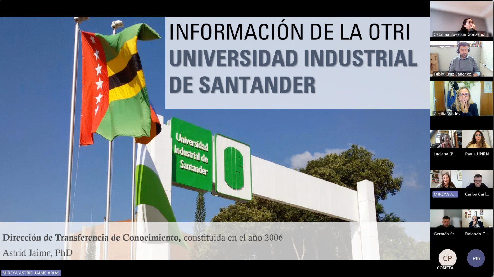{#fig-UIS fig-alt="alt"}
:::

The major concrete shared experience of Prof. Astrid Jaime was focalised on all major problems and issues  on the case of implementation the Tech-Transfer office of Universidad Industrial of Santander in Colombia in 2015.
She gave a landscape from reglamentation issues to the professor engagement in the activities related to the tech transfer in the case of Colombia. 
These aspects elucidated the Colombian context and the strategies that she and her team had to implement.


### Verónica Bucalá -- Co-founder of SophIA-X and Ex-Research Director of PlaPiui - CONICET - Argentina

Véronica leads innovation initiatives and corporate training programs in artificial intelligence, with a focus on the implementation of responsible and applied solutions. She holds a PhD in Chemical Engineering and has developed a distinguished career as a Principal Investigator at CONICET, combining research, teaching, and scientific leadership. 
She served as Director of PLAPIQUI (UNS–CONICET) and as Dean of the Department of Chemical Engineering at the Universidad Nacional del Sur.

:::{layout="[45,-5,45]"}

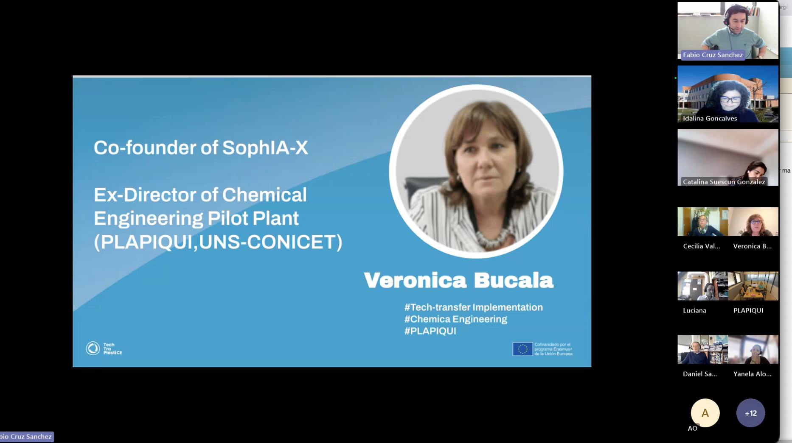{#fig-id fig-alt="alt"}

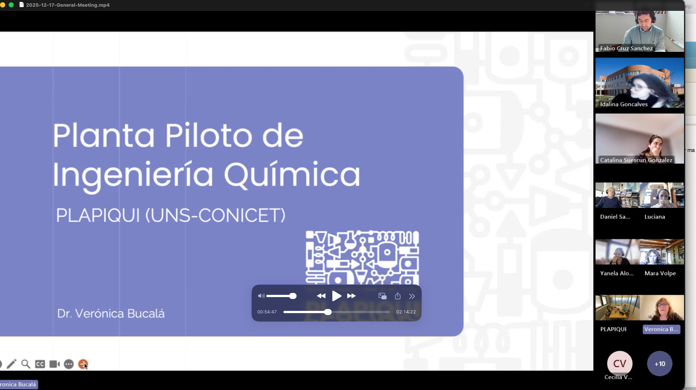{#fig-UIS fig-alt="alt"}
:::

On the monthly general meeting of TechTraPlastiCE in Dec. 2026, she shared to the consortium her experience on the key role in strengthening the link between science and industry and promoting technology transfer processes. 
The major output of this session was to better understand the value of her expertise on process engineering, innovation management, for the articulation between academic knowledge and industrial application.
She gives insigths on the structuration of the portfolio of chemical

This is important for the role that TechTraPlastiCE aims to look for fostering Circular Economy in the plastic value chain. 
The engineering domain plays in oustanding role in this transition. 

### Mara Volpe -- Technical Director at Cyclus in Argentina

 PhD. Mara Volpe leads the development of technology and consulting services grounded in the principles of circular economy and decarbonization. 
 
 She has over 30 years of experience as a scientific researcher, with expertise in heterogeneous catalysis, biomass pyrolysis, biochar production for steel and agricultural industries, and advanced chemical recycling of mixed plastics and end-of-life tires. 
 
 Likewise Veronica, on the general meeeting of Dec. 2026, TechTraPlastiCE consortium had the opportunity to understand the work of Mara at the circular Economy start-up CYCLUS to understand the decarbonization challenges  including the extensive interdisciplinary work across biology, agronomy, and electronic and mechanical engineering, alongside strong collaboration with the private sector. 
 
 
:::{layout="[45,-5,45]"}

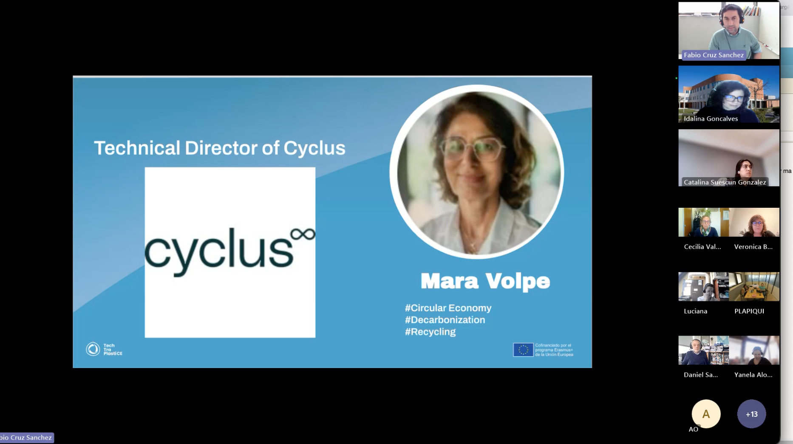{#fig-id fig-alt="alt"}

 on circular economy issues](figures/2.3/Mara-01.jpg){#fig-UIS fig-alt="alt"}

:::

She presented her work focusing on the design and implementation of projects based on a triple bottom line approach, integrating social, environmental, and economic dimensions to promote sustainable practices and innovative solutions.


### Flavio Soldera -- General Manager of the European School of Materials (EUSMAT) at the University of Saarland in Germany 


Flavio holds a PhD in Materials Science and Engineering and has over 25 years of experience in scientific research focused on advanced materials for electrical applications, 3D analysis of micro- and nanostructures, and the use of electron microscopy and focused ion beam techniques. 
He also brings more than 20 years of experience in the coordination and management of international research and education projects. 


On the general meeting of April 2026, the TechTraplastiCE consortium had the view of his work as part of Material Engineering Center Saarland [https://www.mec-s.de/en/welcome-2/](https://www.mec-s.de/en/welcome-2/), an institute dedicated to technology transfer between academia and industry.
We had the opportunity to  he has extensive expertise in collaborating with the industrial sector, particularly in areas related to materials characterization and applied research.
More precisely, He presented the [The European Interreg UniGR-CIRKLA project -- https://www.uni-gr.eu/fr/CIRKLA](https://www.uni-gr.eu/fr/CIRKLA) that  brings together science, industry, and society to accelerate the transition to a circular economy for metals and materials in the Greater Region (Lorraine - Wallonia - Saarland - Luxembourg - Rhineland-Palatinate).


:::{layout="[45,-5,45]"}

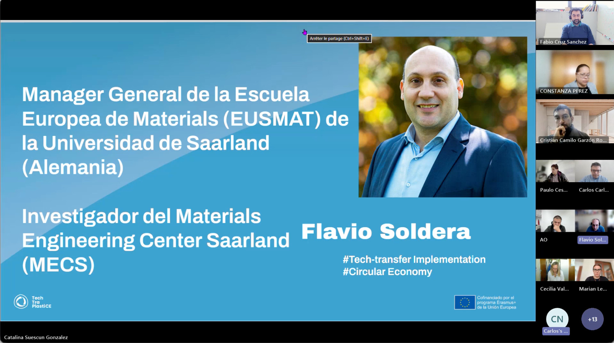{#fig-flavio0 fig-alt="alt"}

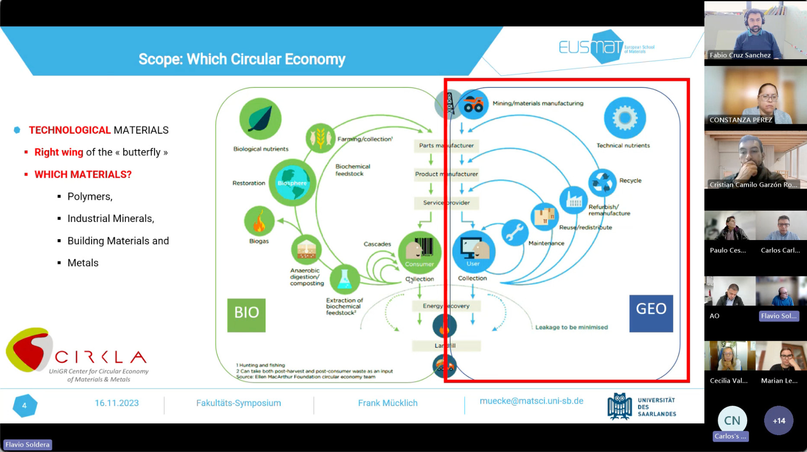{#fig-flavio1 fig-alt="alt"}

:::

This interdisciplinary center of expertise, brings together numerous activities around a clear mission: to create cross-border expertise enabling more sustainable and balanced management of metals and materials across all sectors of the economy and daily life. It is a collective effort driven by shared awareness, practical experimentation, and committed collaboration—at the crossroads of 4 countries, 3 languages, and numerous disciplines.

This cross-border initiative can be an example in the long term taht could be applied to the latin american context.


### Marcos Maldonado -- Research and Development at the Ministry of the Environment in  Chile.

Marcos Maldonado plays a key role in the design and coordination of public policies related to science, technology, and innovation at Chile.
His expertise lies in innovation management, research coordination, and the integration of scientific knowledge into policy and practice. 

He holds dual Chilean and French degrees in Industrial and Systems Engineering, as well as a Master II in Innovation Management and Industrial Design. His professional experience includes the promotion and management of innovation projects aligned with forestry and agricultural priorities, contributing to sustainable development and the articulation between scientific research and public policy.


:::{layout="[[45,-5,45] ]"}

:::{}
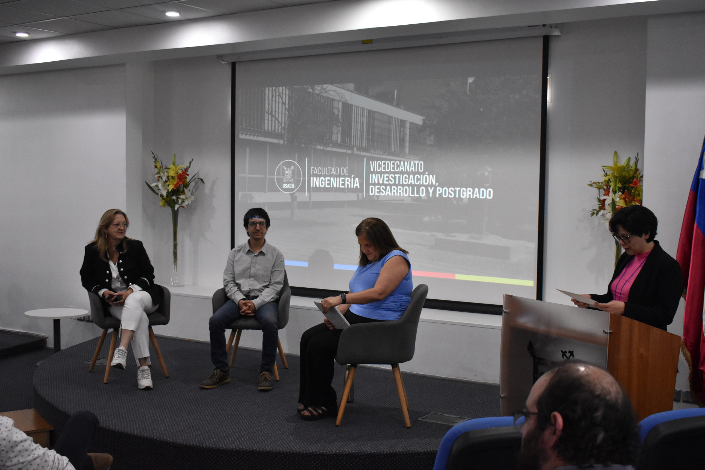{#fig-chile width="90%"}

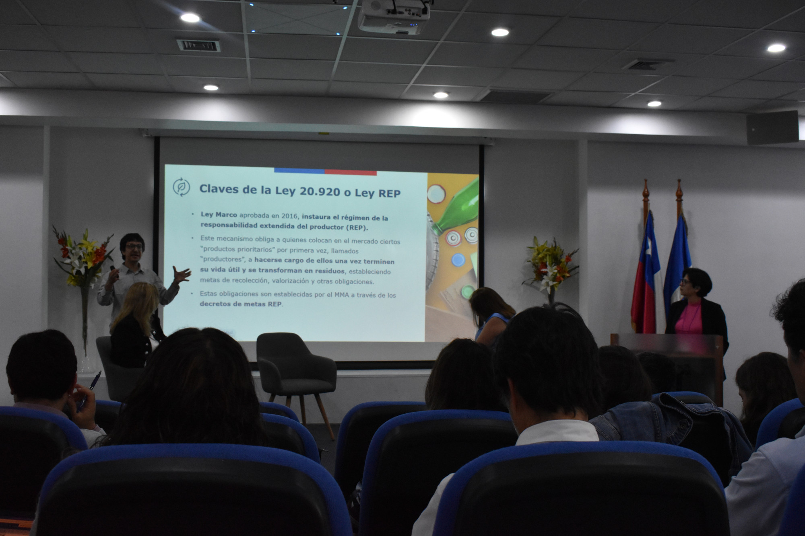{#fig-flavio1 width="90%"}
:::

:::{}
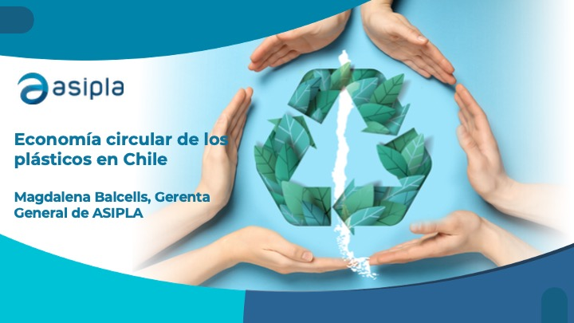{#fig-chile2 width="90%" fig-align="center"}

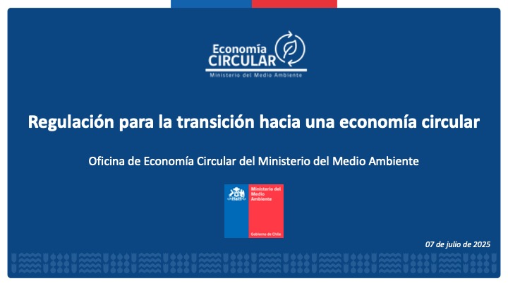{#fig-chile3 width="90%" fig-align="center"}

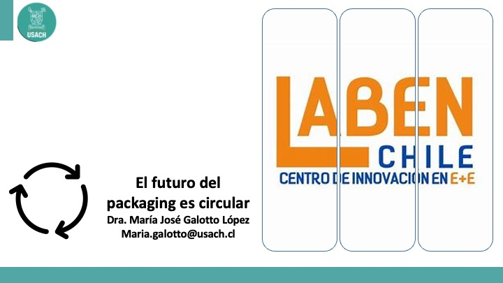{#fig-chile4 width="90%" fig-align="center"}
:::

:::


During the general meeting of TechTraPlastiCE in Chile, we had the opportunity to introduce him to the consortium. 
Indeed, thanks to his role at the Ministry of the Environment, it was possible to organize the panel  entitled: *'Circular Economy in the Plastic Value Chain in Chile: A shared challenge between government, academia and industry within the framework of the TechTraPlastiCE project'* with Prof. Andrea Espinoza from USACH, Tomás Saieg (Office of Legislative Implementation and Circular Economy of Chilean ministery)
Magdalena Balcells -- ASIPLA Asociación Gremial de Industriales del Plástico (Trade Association of Plastics Manufacturers) and Prof. María José Galotto (USACH) which leads the "Technology Center for Innovation in Packaging at the University of Santiago, Chile (Centro Tecnológico de Innovación en Envases y Embalajes Universidad de Santiago de Chile. [LABEN CHILE- https://www.labenchile.cl/](https://www.labenchile.cl/))".

This panel enlights the systemic problem of plastic and all perspectives (goverment, industry and academia) that entails the transition towards circular economy.
The TechTraPlastiCE consortium had major interactions and dicussions on the experience that Chilean context is taking place.
In the Annex @sec-planning, the complete agenda of the meeting can be found.

\newpage

## Identification of collaboration opportunities

The analysis of the canvas results revealed a strong shared recognition of the value of collaborative work as a mechanism to enhance technology transfer.
Three main areas of collaboration were identified:

1. **Integrated technological services**, including circularity assessment, eco-design, materials characterization, and validation of solutions in real environments.
2. **Joint applied R&D projects**, focused on developing new materials, processes, and sustainable business models.
3. **Training and capacity-building initiatives**, such as joint programs, courses, workshops, and mobility schemes.

In addition, more structural initiatives were proposed, including shared technology transfer platforms, laboratory networks, and joint innovation spaces, reflecting a move towards more institutionalized forms of collaboration. 
From the perspective introduced through the open innovation approach, these collaboration opportunities can also be interpreted as potential co-creation processes, where institutions and external stakeholders jointly define challenges and develop solutions from early stages.

In this context, the analysis highlights the importance of moving beyond traditional transfer mechanisms, such as service provision or technology delivery, towards more interactive and iterative models of collaboration.
This includes the integration of interdisciplinary teams, the use of participatory dynamics for problem definition, and the progressive validation of solutions. 

A relevant example discussed during this process was an applied case developed at *PLAPIQUI* [https://www.plapiqui.conicet.gov.ar/](https://www.plapiqui.conicet.gov.ar/), in which a challenge from the petrochemical sector was addressed through a co-creation approach. 
The process involved the formation of interdisciplinary teams, the generation of ideas through participatory methodologies, and the systematic evaluation of alternatives based on technical feasibility. 
This experience illustrates how open innovation frameworks can support the transition from a broad set of initial ideas to concrete solutions with transfer potential. 
These insights reinforce the role of universities not only as providers of technological solutions but also as strategic partners in collaborative innovation processes.


## Workshop on cross-peer collaboration and mentoring dynamics

On March 26/2026, a virtual workshop was organized with the EAB Members as presented in @fig-eba.
We had the participation of 6 of them. 

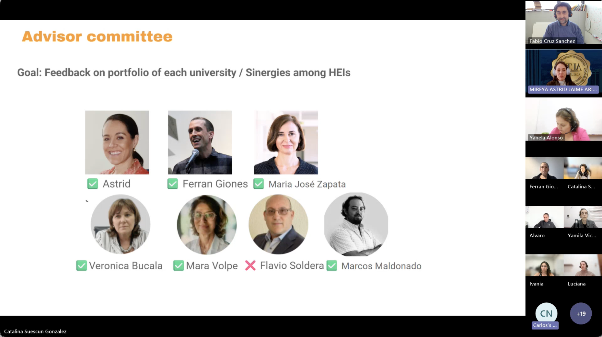{#fig-eba fig-alt="alt"}

Tha major objective of the workshop was *to foster the exchange of experiences among Latin American universities from Chile, Colombia, and Argentina, in order to deepen the understanding of the structural opportunities and barriers identified in WP2, related to technology transfer linked to the circular economy of the plastics value chain*.  

The aim was to identify patterns, similarities, and differences in approaches among universities, in order to obtain strategic recommendations from members of the external advisory board to strengthen both individual and collective service portfolios.

We structured the session in four blocks as follows:

1. **Block 1 (10 min): Contextualization**
     - **TechTraPlastiCE Introduction (UL – 3 min):**   Introduction of the project’s key objectives and clarification of the current stage of progress. The purpose of the session will also be explained, emphasizing that the goal is not to evaluate portfolios, but to understand how institutional contexts shape technology transfer.
     - **Presentation of EBA Members (7 min total):**  Introduction of the participating members of the External Advisory Board (EBA).

2. **Block 2 (30 min): University Round (by regions: Argentina, Chile, Colombia, and Europe)**

Each university will have **3 minutes** to highlight:

- Brief introduction of the speaker (profile, role within the university)
- What should be the approach to tackling the challenge over the next 12 months, including the methodology based on the conducted assessment and the specific institutional context
- What concrete activities or actions they intend to implement, and what resources are available

For example, if the proposal is to strengthen institutional coordination, the focus should now be on **how** they would act to achieve this goal.
This also helps refresh each university’s context and complements answers to the following questions:

- What was the most difficult aspect of mapping our portfolio?
- What did we discover about our transfer culture?
- What is currently our main institutional barrier?
- If we had to prioritize a single critical point to improve within 12 months, it would be.


3. **Block 3 (30 min): Guided Discussion with Advisors**

The questions for the advisors were around:

  a. **Common Patterns**: Based on the videos and presentations:
     - What structural barriers are repeated across universities?
     - What cultural or institutional patterns most influence technology transfer?
  b. **Differences Between Contexts**
     - What relevant differences do you identify among institutional or regional contexts?
     - How do you think these differences affect transfer capacity?
  c. **Opportunities**
     - What strengths or opportunities do you see in the consortium that could be better leveraged collectively?

4. **Block 4 (15 min): Final Strategic Recommendation**

Final question to the EBA was :

- Based on what was observed across the consortium universities, what would be the **two strategic recommendations and/or intra/inter/extra-institutional synergies** that could help strengthen technology transfer in the short and medium term?


The results highlight the emergence of cross-peer collaboration and mentoring opportunities within the consortium. Institutions identified potential areas for knowledge exchange based on their relative strengths, particularly in:

* Portfolio development and management,
* Engagement with industry,
* Implementation of transfer strategies and ,
* Development of training and outreach activities.

This dynamic reflects the diversity of institutional profiles within the consortium, where differences in experience, orientation, and maturity create opportunities for mutual learning and support. 

A distinction can be observed between institutions with more consolidated transfer practices, which can act as mentors, and institutions seeking to strengthen specific aspects of their transfer systems. This complementary dynamic constitutes a key foundation for structured peer-learning processes.


### Key barriers and strategic recommendations

The interaction with the EAB enabled the identification of common barriers affecting technology transfer across institutions, including:

* Bureaucratic constraints and internal fragmentation,
* Limited articulation with external stakeholders,
* Low visibility of technological offerings,
* Weak transfer culture and,
* Lack of standardization.

In response, several strategic recommendations were highlighted:

* fostering internal coordination through formal and informal interaction spaces,
* improving communication and visibility of institutional capacities,
* adopting hybrid governance models,
* implementing tools for managing interactions (e.g., Customer Relationship Management, CRM, systems),
* and promoting long-term relationships with external stakeholders.

Additionally, technology transfer was emphasized as a continuous and dynamic process, requiring ongoing portfolio updates and sustained engagement with external actors.


### Towards a network-based transfer model

The results also demonstrated that the consortium has a strong potential to evolve towards a more collaborative and network-based model of technology transfer. 
The identification of complementarities, mentoring opportunities, and shared challenges provides a solid foundation for developing coordinated actions and joint initiatives. 

At the same time, the results highlight the need to strengthen coordination mechanisms, align institutional processes, and consolidate communication channels. 
In this context, D2.3 represents a transition from institutional capacity mapping to network activation, where collaboration, peer-learning, and mentoring become key drivers for enhancing the impact of technology transfer activities within the plastic circular economy.


## Matching framework for cross-peer collaboration and mentoring

Building upon the identification of institutional profiles (D2.2) and the complementarities detected through the canvas analysis and the EAB interaction, a structured matching framework was developed to facilitate cross-peer collaboration and mentoring within the consortium.
This framework aims to connect partner institutions based on:

* their level of experience in technology transfer,
* their dominant transfer profile (technical/technological, social, hybrid, etc.),
* and their specific needs and strategic priorities.

Rather than a fixed pairing system, the matching approach is conceived as a flexible and dynamic mechanism that enables different types of collaboration depending on the context and objectives.


### Matching criteria

Three main criteria were used to identify potential matches:

* **Affinity**: institutions sharing similar thematic interests (e.g., circular economy, materials, sustainability).
* **Complementarity**: institutions with different but compatible capacities (e.g., advanced infrastructure vs. territorial implementation).
* **Mentoring potential**: institutions with more consolidated transfer practices supporting those seeking to strengthen specific capabilities.


### Types of matching identified

Based on the analysis, three main types of matching were identified:

1. **Mentoring-based matching: **focuses on knowledge transfer between institutions with different levels of experience.   
 Examples:

     - Support in portfolio implementation
     - Transfer of methodologies for engagement with industry
     - Development of internal transfer structures

2. **Complementarity-based matching: **combines different capacities to develop joint solutions or services.  
 Examples:

     - Linking technological development with real-scale validation
     - Integrating laboratory capabilities with territorial implementation
     - Combining technical expertise with innovation management

3. **Affinity-based matching:** connects institutions with similar orientations to scale activities or co-develop initiatives. \
 Examples:

     - Joint training programs
     - Collaborative research projects
     - Shared thematic clusters


### Matching matrix and implementation pathways

@fig-matchs presents a proposed mapping of potential interactions among partner institutions.
@fig-match0 propose a mentoring-based match between the partners of the consortium.
@fig-match1 propose a complementarity-based match while @fig-match2 present a affinity-based approach. 

Table 1 describes potential actions between partners, with a focus on specific activities. Both the figures and the table are classified according to the type of matching. The process was not based on arbitrary pairing, but on a systematic analysis of institutional profiles, identifying how different types of capacities (technological, managerial, and socio-territorial) can be articulated along the technology transfer process.


:::{#fig-matchs layout="[30,-2,33,-2, 30]"}
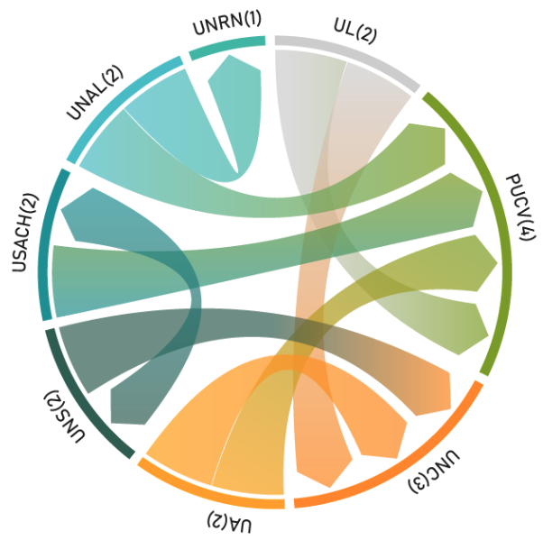{#fig-match0 width="90%" fig-align="center"}


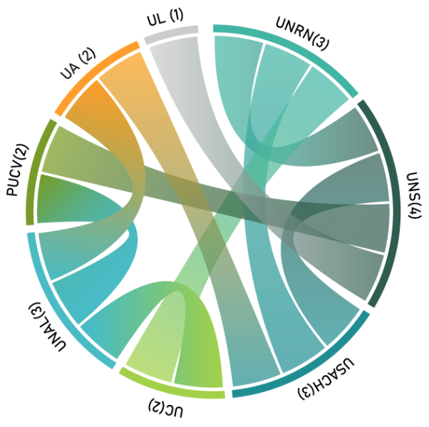{#fig-match1 width="90%" fig-align="center"}

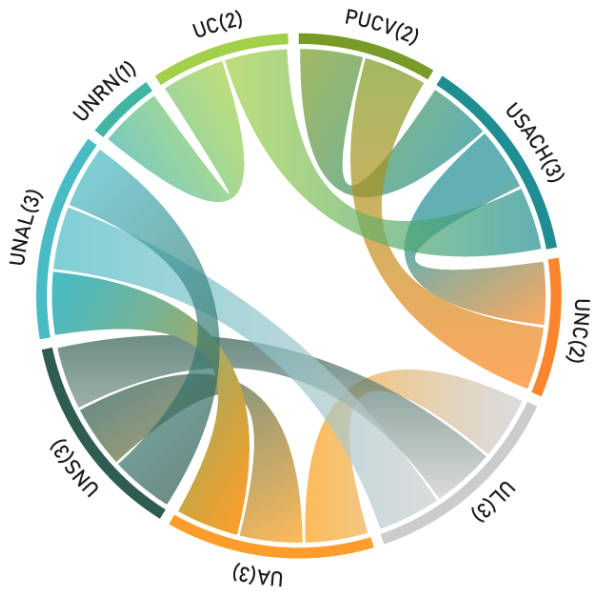{#fig-match2 width2="90%" fig-align="center"}

Potential interactions among partner institutions
:::


The matching matrix presented provides a structured representation of potential collaboration pathways within the consortium, translating institutional complementarities into concrete interaction opportunities. Building on this analytical framework, the following section outlines the operational mechanisms and actions required to activate these matches and transform them into effective cross-peer collaboration and mentoring dynamics.


\newpage

:::landscape
```{r}
#| label: tbl-link
#| tbl-cap: "Matching matrix including the reason of the potential links, their focus, the expected results and proposed actions."

table <- 
tribble(
~"Type",
~"Institutions",
~"Justification (based on D2.2 profiles)",
~"Focus",
~"Expected outcome",
~"Actions",
"Complementarity",
"UNS -- USACH",
"UNS: strong technological development; USACH: innovation \\& management tools",
"TRL scaling + innovation management",
"From prototype to implemented solution",
"Joint pilots, industry cases, co-designed services",
"Complementarity",
"UNS -- UNRN",
"UNS: technological development; UNRN: territorial and socio-environmental implementation",
"Lab-to-territory transfer",
"Real-world validation of technologies",
"Field pilots, co-developed solutions with local actors",
"Complementarity",
"UNAL -- UC",
"UNAL: advanced technical services; UC: socio-technical and policy-oriented approach",
"Integrated circular economy solutions",
"Combined technical, social, and policy impact",
"Joint consultancy, policy-oriented services",
"Complementarity",
"UA -- USACH",
"UA: advanced infrastructure; USACH: innovation processes and management",
"Applied innovation processes",
"Increased readiness for industry application",
"Innovation labs, co-design workshops",
"Complementarity",
"UL -- UNS",
"Both strong technical/technological profiles with advanced capabilities",
"Advanced materials \\& processes",
"High-level technological solutions",
"Joint R\\&D, shared infrastructure",
"Complementarity",
"UA -- UNAL",
"UA: materials characterization; UNAL: bio-based developments",
"Material validation and scaling",
"Strengthened development pipeline",
"Testing protocols, joint validation",
"Complementarity",
"PUCV -- UNS",
"PUCV: early-stage developments; UNS: scaling and engineering capacity",
"TRL progression",
"Scaling of technologies",
"Prototype-to-pilot transition projects",
"Complementarity",
"USACH -- UNRN",
"USACH: innovation and management; UNRN: social and territorial implementation",
"Sustainable innovation systems",
"Context-adapted solutions",
"Territorial innovation pilots",
"Complementarity",
"PUCV -- UNAL",
"PUCV: training \\& early-stage innovation; UNAL: applied technological expertise",
"Knowledge-to-application integration",
"Stronger link between training and applied solutions",
"Joint training + applied pilot projects",
"Complementarity",
"UC -- UNRN",
"Both with socio-territorial orientation but different approaches (policy vs implementation)",
"Social innovation in circular economy",
"Strengthened territorial impact strategies",
"Joint projects with local stakeholders",
"Mentoring",
"UL, UA -- PUCV, UNC",
"EU: structured and consolidated services; LATAM: emerging structuring processes",
"Service standardization",
"More robust and structured portfolios",
"Templates, benchmarking, technical guidelines",
"Mentoring",
"UNS -- UNC",
"UNS: consolidated technological profile; UNC: smaller scale and emerging structure",
"Strengthening technical transfer",
"Improved articulation between services and developments",
"Technical mentoring, lab practices",
"Mentoring",
"USACH → PUCV",
"USACH: innovation-oriented; PUCV: hybrid profile",
"Innovation structuring",
"Stronger innovation component",
"Workshops, methodology transfer",
"Mentoring (bidirectional)",
"UNS -- USACH",
"Complementarity between technological development and innovation management",
"Mutual learning",
"Integrated transfer models",
"Peer-learning exchanges, joint pilots",
"Mentoring",
"UNAL -- PUCV, UNRN",
"UNAL: strong technical services and environmental focus",
"Strengthening applied services",
"Improved service portfolio quality",
"Training sessions, methodological transfer",
"Affinity",
"PUCV, USACH, UNC",
"Hybrid profiles with strong training components",
"Training \\& education",
"Expanded joint training offer",
"Joint courses, mobility programs",
"Affinity",
"UL, UA, UNS, UNAL",
"Technical/technological profiles",
"Advanced services and R\\&D",
"Consolidated technical offer",
"Shared service platforms, joint R\\&D",
"Affinity",
"UNRN, UC",
"Social and territorial orientation",
"Community engagement",
"Strengthened local impact",
"Joint territorial projects",
"Affinity",
"USACH, UC",
"Strong orientation to management and innovation processes",
"Innovation and governance",
"Improved transfer strategies",
"Joint innovation frameworks",
"Cross-cutting",
"All institutions",
"Shared need: visibility of capacities",
"Portfolio communication",
"Increased external engagement",
"Common platform, branding strategies",
"Cross-cutting",
"All institutions",
"Weak articulation with industry (EAB insight)",
"Industry engagement",
"Stronger transfer impact",
"Demo days, brokerage events",
"Cross-cutting",
"EU -- LATAM",
"Different maturity levels and institutional contexts",
"Knowledge transfer",
"Balanced capacity building",
"Staff exchange, mentoring schemes",
"Cross-cutting",
"All institutions",
"Need for continuous transfer culture",
"Open innovation and co-creation",
"Dynamic collaboration ecosystem",
"Co-creation workshops, challenge-based collaboration, living labs",
"Cross-cutting",
"All institutions",
"Need to systematize interactions and contacts",
"Transfer management",
"Improved traceability and efficiency",
"CRM systems, shared databases",
)

table %>%
  mutate_all(linebreak) %>%
  kbl("latex", booktabs = T, escape = F,
      longtable = T, 
      linesep = "\\midrule\\addlinespace"
      ) %>%
   kable_styling(full_width = F,    
               latex_options = c("repeat_header"),
                font_size = 9) %>% 
   row_spec(0, color = "white", background = "Naranja", bold = T, font_size = 12) %>%
   column_spec(1, width = c("2.5cm"))  %>%
   column_spec(2, width = c("3cm"))  %>%
   column_spec(3, width = c("5cm"))  %>%
   column_spec(4, width = c("3cm"))   %>%
   column_spec(5, width = c("3cm"))  %>%
   column_spec(6, width = c("3cm"))  

```

:::


### Implementation/Operationalization of the matching framework

To ensure its practical implementation, the matching framework is supported by a set of operational actions that could enable the transition from identified opportunities to concrete collaboration dynamics.

These actions include:

* **Peer-learning sessions** focused on specific challenges (e.g., portfolio management, industry engagement).
* **Mentoring schemes**, where more experienced institutions support others through structured exchanges.
* **Joint pilot initiatives**, allowing the testing of collaborative services or solutions.
* **Co-development of training activities**, including courses, workshops, and mobility programs.
* **Collaborative project development**, aimed at leveraging complementarities for future funding opportunities.

This operational perspective proposal ensures that the matching process is not limited to analytical identification but evolves into actionable collaboration pathways, aiming to reinforce the long-term impact of the consortium.

### Illustrative cases of cross-peer collaboration and mentoring

As part of the bidirectional mentoring dynamic identified between UNS and USACH, based on the complementarity between technological development capacities and innovation management approaches, several concrete collaboration initiatives have begun to emerge, illustrating the operationalization of the matching framework. 

A first relevant experience is linked to the implementation of the *“48 hours of innovation” activity planned within the TechTraPlastiCE project at UNS during the second half of 2026*. 
In this context, USACH has provided methodological support and training to UNS for the design and execution of this initiative, transferring practical knowledge on innovation dynamics, facilitation strategies, and impact-oriented approaches. This exchange not only reflects a mentoring process but also a co-learning dynamic, where methodologies are adapted to the local institutional context. 

**Building on this interaction, a new elective course on innovation has been introduced within the Chemical Engineering Department at UNS**. 
The course design has been directly informed by the experience and guidance provided by USACH, incorporating approaches aimed at strengthening students’ innovation capabilities and also, preparing them for active participation in the “48 hours of innovation” initiative. 
This represents a concrete example of how knowledge transfer between institutions can be embedded into academic structures, amplifying its impact through education and capacity building.

In parallel, institutional-level interactions have been initiated between the internationalization offices of UNS and USACH, aiming to explore and consolidate longer-term collaboration mechanisms. 
Within the existing framework of the Asociación de Universidades Grupo Montevideo (AUGM), discussions have led to the proposal of implementing the innovation course as a “mirror course” (cátedra espejo) in both institutions. 
This initiative would enable synchronized teaching experiences, fostering shared learning environments and setting a precedent for future joint academic activities. Additionally, preliminary discussions have explored the potential development of joint postgraduate or specialization programs, although these initiatives require further institutional alignment and regulatory processes.


Beyond the UNS–USACH collaboration, additional inter-institutional linkages have been identified within the consortium. In particular, emerging interactions between UNS (including PLAPIQUI) and the Universidad Nacional de Córdoba (UNC) are being strengthened through the connection with the Instituto de Procesos y Química Aplicada (IPQA). 
This institute, currently established within UNC as a research and development unit, originated from scientific and technological capacities initially developed at PLAPIQUI (UNS–CONICET), later evolving towards institutional independence. This shared trajectory provides a strong foundation for collaboration, as it reflects not only complementary capacities but also a common scientific background and aligned research approaches. In this context, with the collaboration of thehhte Secretariat of Sustainable Policies, exchanges between researchers involved in sustainability-related lines within the project, the Faculty of Dentistry and IPQA members have enabled the identification of potential joint initiatives focused on plastics sustainability. These prospective collaborations aim to articulate advanced research capabilities with applied technology transfer, reinforcing long-term cooperation between both institutions.

Furthermore, synergies have been identified with other Erasmus+ Capacity Building projects within UNS, particularly the EduSAF project ([https://www.edusafproject.eu/](https://www.edusafproject.eu/)). Although focused on the agri-food sector, EduSAF shares a strong emphasis on innovation, capacity building, and university–society interaction. 
Initial exchanges between both projects have opened opportunities for cross-project collaboration, especially in areas related to innovation methodologies, training approaches, and stakeholder engagement strategies. 
This highlights the potential for scaling impact not only within the TechTraPlastiCE consortium but also across parallel Erasmus+ initiatives.

Overall, these experiences illustrate how the identified matching dynamics can evolve into concrete actions, combining mentoring, co-development, and institutional collaboration. They also demonstrate that cross-peer interaction extends beyond bilateral exchanges, enabling the creation of broader innovation ecosystems that integrate multiple institutions and projects.


# Conclusions

This deliverable consolidates the transition from the identification and structuring of institutional capacities (D2.2) to their activation through collaboration and peer-learning processes within the consortium. 

Results demonstrated that the diversity of institutional profiles constitutes a key asset, enabling the development of complementary and synergistic interactions among partners. The identification of collaboration opportunities, combined with the emergence of mentoring dynamics, provides a strong foundation for advancing towards more coordinated and effective technology transfer practices. 

Moreover, the perspective of the External Advisory Board contributed with valuable strategic insights, reinforcing the need to address structural barriers while adopting a long-term and dynamic approach to technology transfer. 

In this context, D2.3 highlights the importance of moving towards a network-based model, where collaboration, knowledge exchange, and mutual support enhance the capacity of higher education institutions to respond to the challenges of the plastic circular economy and to generate impact at regional and international levels.


# Annex


## Agenda of the Presential Consortium Meeting in Santiago de Chile. {#sec-planning}

\includepdf[pagecommand={\pagestyle{fancy}}, scale=0.9,
pages=-]{figures/2.3/Agenda.pdf}


\includepdf[landscape=false,  delta=2 2, frame=true,  nup=2x3, pagecommand*={\pagestyle{fancy} \section{Presentation of Open Innovation and presentation of Véronica Bucala and Mara Volpe on General Meeting of Dec. 17/2026}}, 
scale=0.8, pages=-]{annex/2.3/2025-12-17-General-Meeting.pdf}


