# Work Package 2: Development of a networked portfolio

:::{.callout-tip }

## Goal of WP2

This WP will address the various types of responses to the needs of the industry and sectors for a circular economy by identifying University missions - research, innovation, lifelong learning, assistance, and services.  Based on that, a collective portfolio for the plastics value-chain based on the university's core competencies and knowledge will be created. This WP will also promote cross-peer collaboration and sharing of practices and knowledge among partners.  

:::

## Methodology 

:::{.column-page}

### Presentation of the Methodology

:::{layout="[[20,20,20,20,20],[20,20,20,20,20]]" layout-valign="center"}

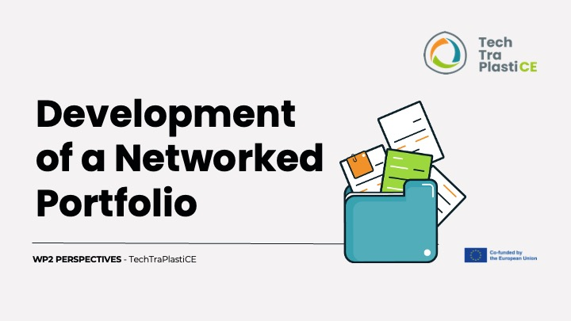{group="my-gallery"}

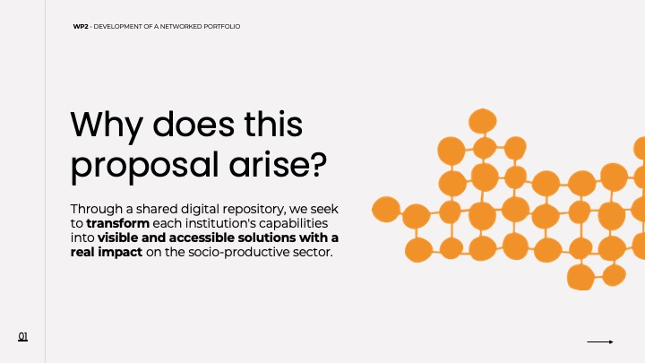{group="my-gallery"}

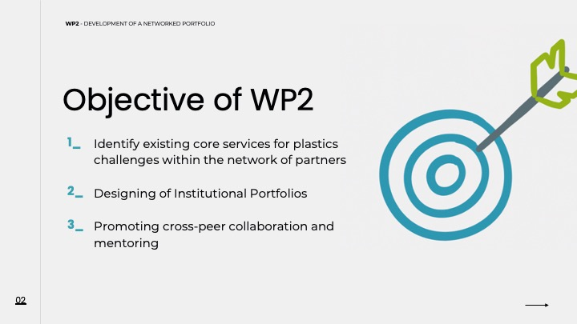{group="my-gallery"}

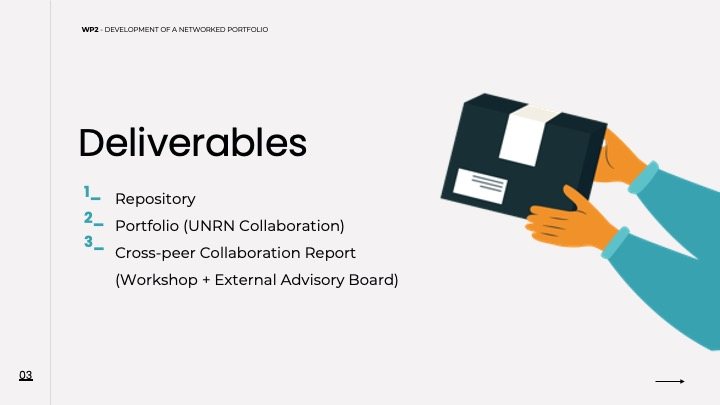{group="my-gallery"}

{group="my-gallery"}

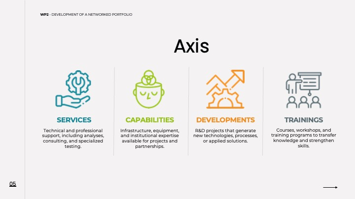{group="my-gallery"}

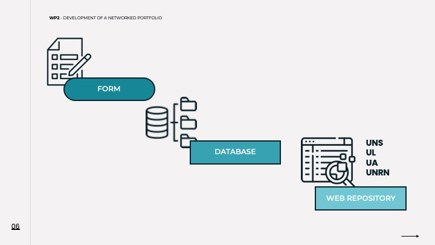{group="my-gallery"}

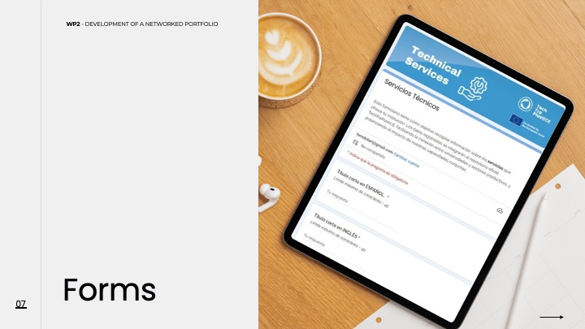{group="my-gallery"}

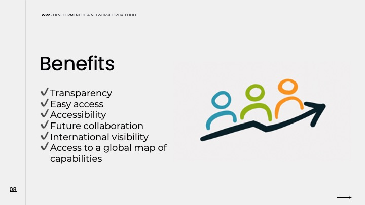{group="my-gallery"}

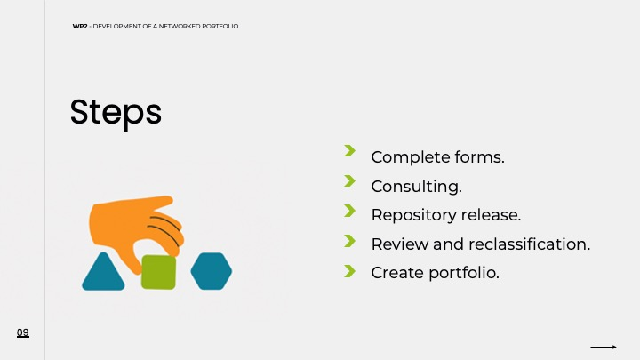{group="my-gallery"}

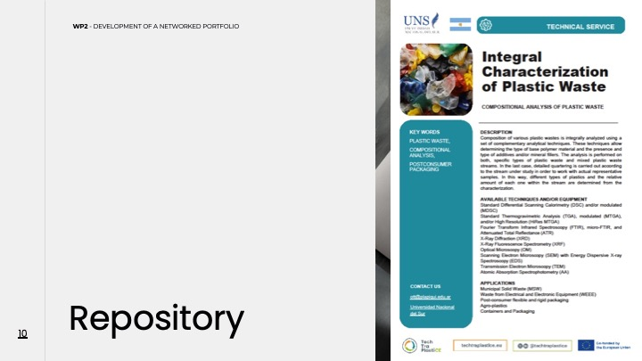{group="my-gallery"}

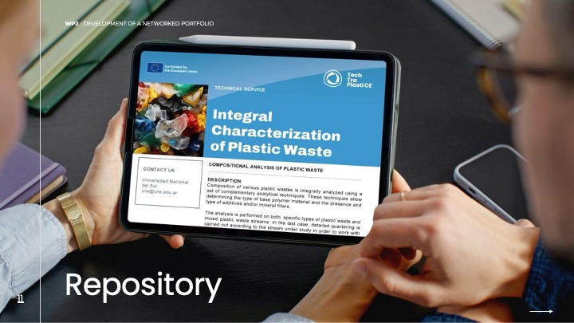{group="my-gallery"}

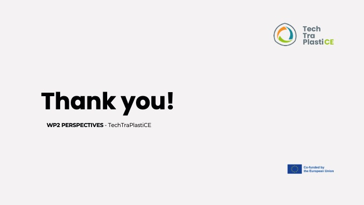{group="my-gallery"}
:::

:::{.column-page-inset}

:::{layout="[[50, 50],[50,50]]" layout-valign="center"}
### Services



### Capabilities



### Developments



### Trainings



:::
 

## Session with External Advisory Board - March 26, 2026

## Argentine

:::{layout="[30, 30, 30]" layout-valign="center"}

:::{}
### Universidad Nacional de Rio Negro

<iframe
  width="100%"
  height = auto
  src="https://drive.google.com/file/d/1iMwveKJmqK2w0pOcvV5zAbzOAAf5kHsB/preview">
</iframe>
:::

:::{}
### Universidad Nacional del Sur

<iframe
  width="100%"
  height = auto
  src="https://drive.google.com/file/d/1u_VT8CQKF_Wv1e66J7iLUH4Yg123NZjO/preview">
</iframe>
:::

:::{}
### Universidad Nacional de Cordoba


:::
:::

 

## Colombia

:::{layout="[50, 50]" layout-valign="center"}

### Universidad Nacional de Colombia



### Universidad Central



:::

 
## Chile

:::{layout="[50, 50]" layout-valign="center"}

:::{}
### Pontificia Universidad Catolica de Chile


:::

:::{}
### Universidad Santiago de Chile

<iframe
  width="100%"
  height = auto
  src="https://drive.google.com/file/d/15-h_F5JeVK9hF7LbDdUFZ9N_DUKiT08q/preview">
</iframe>

:::
:::
 

## European Union

:::{layout="[50, 50]" layout-valign="center"}

### Université de Lorraine



:::{}
### Universidade de Aveiro


:::
:::